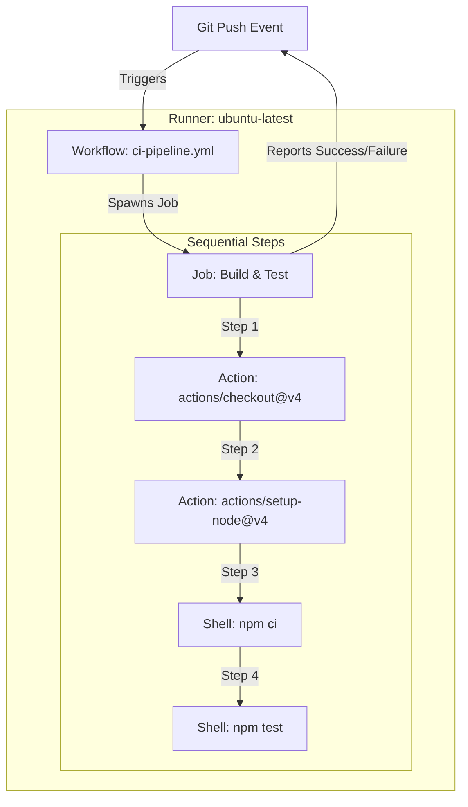

# GitHub Actions Study Notes: Day 1 (4 May 2026)
## Topic: Core Architecture and Workflow Automation

Welcome to Day 1 of the GitHub Actions Intensive. Today, we lay down the foundational pillars of GitHub Actions (GHA). These notes are tailored for both university practical examinations and rigorous technical placement interviews.

---

## 1. Detailed Theory Notes

### What is Workflow Automation?
Workflow automation is the process of defining, executing, and managing a sequence of tasks automatically based on specified triggers. In modern software engineering, this is the backbone of **CI/CD (Continuous Integration and Continuous Deployment)**.
* **Continuous Integration (CI)**: The practice of automatically building, testing, and merging code changes into a shared repository frequently to detect integration issues early.
* **Continuous Deployment (CD)**: The practice of automatically deploying code changes to production or staging environments after passing automated tests.

### Why GitHub Actions?
Unlike older tools like Jenkins (which require self-hosted master-agent configuration, plugin maintenance, and separate server management), GitHub Actions is a **fully integrated cloud-native CI/CD platform** built directly into GitHub. Key advantages include:
1. **Zero Setup Cost**: Hosted runner resources are provided out-of-the-box by GitHub.
2. **First-Class Integration**: Secure authentication with the host repository via the automatic `GITHUB_TOKEN`.
3. **Reusable Marketplace**: A massive ecosystem of pre-built, community-vetted actions for common tasks.
4. **Configuration as Code**: Pipelines are declared using human-readable **YAML** files stored directly within the repository.

### Core Architectural Components
A GitHub Actions workflow is made up of five key hierarchical components:

```
Workflow
  └── Job(s) (runs in parallel by default, on a specific Runner)
        └── Step(s) (runs sequentially inside the Job container/VM)
              ├── Action (reusable modular task)
              └── Shell Command (raw script execution)
```

1. **Workflow**: A configurable automated process that will run one or more jobs. Defined by a YAML file in your repository.
2. **Event / Trigger**: A specific activity in your repository that triggers a workflow run (e.g., code push, pull request open, schedule cron, manual click).
3. **Runner**: The physical or virtual machine that runs the workflow jobs. GitHub provides hosted runners (Ubuntu, Windows, macOS), or you can host your own.
4. **Job**: A set of steps that execute on the same runner. By default, jobs run in parallel but can be configured to run sequentially using dependencies.
5. **Step**: An individual task that can run commands or actions. Steps in a job run sequentially on the same runner, allowing them to share data.
6. **Action**: A standalone application/task that is packaged for reuse within a step. You can write your own or import them from the GitHub Marketplace.

---

## 2. Architectural Diagram (Mermaid)

The following sequence and dependency chart illustrates the lifecycle of a GitHub Actions execution triggered by a Git push event:



---

## 3. Workflow Directory Structure

GitHub Actions has a strict directory convention. Workflows **must** be stored in the following path relative to the root of your repository:

```text
my-repository/
├── .github/
│   └── workflows/
│       ├── ci.yml
│       └── cd.yml
└── src/
```

* **Note**: Folder names `.github` and `workflows` are completely case-sensitive and must be pluralized precisely as shown.
* File extensions must be either `.yml` or `.yaml`.

---

## 4. Production-Grade YAML Example

Below is a foundational, fully annotated YAML workflow file (`.github/workflows/day1-basic-ci.yml`) illustrating the core hierarchy:

```yaml
# The name of the workflow as it will appear in the GitHub Actions tab
name: Day 1 - Foundational CI Pipeline

# Defines the trigger events for the workflow
on:
  push:
    branches:
      - main
  pull_request:
    branches:
      - main

# Defines the jobs that run in this workflow
jobs:
  # Job ID (must be unique within the workflow)
  verify-environment:
    name: Core Environment Validation
    # The operating system environment of the Runner VM
    runs-on: ubuntu-latest

    # The sequential steps of this specific job
    steps:
      # Step 1: Check out the repository code onto the runner VM
      - name: Checkout Code
        uses: actions/checkout@v4

      # Step 2: Set up a programming language environment
      - name: Set up Node.js Runtime
        uses: actions/setup-node@v4
        with:
          node-version: '20'

      # Step 3: Print diagnostic information using a Shell command
      - name: Run System Diagnostics
        run: |
          echo "==== RUNNER DIAGNOSTICS ===="
          echo "Operating System: $(uname -a)"
          echo "Node.js Version: $(node -v)"
          echo "NPM Version: $(npm -v)"
          echo "Workspace Directory: $GITHUB_WORKSPACE"
          echo "Actor (Triggered By): $GITHUB_ACTOR"

      # Step 4: Run a mock build script
      - name: Run Build Phase
        run: echo "Compiling assets and building application..."
```

---

## 5. Practical Exercises

### Exercise 1: Build your first "Hello World" Pipeline
1. Create a public/private GitHub repository.
2. In the local root directory, run: `mkdir -p .github/workflows` (Linux/macOS) or `mkdir .github; mkdir .github/workflows` (Windows).
3. Create a file named `hello-world.yml` inside `.github/workflows/`.
4. Write a simple workflow that triggers on `push` and runs a single job containing a single step printing "Hello, GitHub Actions!".
5. Commit, push, and monitor the output under the **Actions** tab on GitHub.

### Exercise 2: Runner OS Introspection
1. Write a workflow that executes shell commands to inspect the Runner's system specifications.
2. Log CPU specs (`lscpu` or `sysctl -a`), RAM info (`free -h`), and pre-installed tools (`docker --version`, `git --version`).

---

## 6. Viva Questions (University Exam prep)

**Q1: Where must GitHub Actions workflows be stored within a repository?**
* **Answer**: They must be stored in the `.github/workflows/` directory in the root of the repository, using either `.yml` or `.yaml` as the file extension.

**Q2: What is the default execution behavior of multiple Jobs defined inside a single workflow file?**
* **Answer**: By default, multiple jobs run **in parallel** concurrently on separate runners. If you need sequential execution, you must define dependencies using the `needs` keyword.

**Q3: Explain the difference between `run` and `uses` keywords in a Step.**
* **Answer**:
  * `run`: Executes a raw command-line command or script using the runner's system shell (e.g., bash, powershell).
  * `uses`: Imports and runs a pre-built, reusable action from the GitHub Marketplace or a local path (e.g., `actions/checkout@v4`).

**Q4: What is a Runner in GitHub Actions?**
* **Answer**: A Runner is a virtual machine or physical server equipped with the GitHub Actions runner agent that receives jobs from GitHub, runs the defined steps, and reports the logs and results back to GitHub.

---

## 7. Interview Questions (Placement prep)

**Q1: Contrast GitHub Actions with Jenkins. Under what circumstances would you choose one over the other in enterprise systems?**
* **Answer**:
  * **GitHub Actions** is highly integrated, serverless (managed hosted runners), YAML-native, and facilitates modular workflows via marketplace plugins. It's the standard for modern git-centric setups with rapid release cycles.
  * **Jenkins** is self-hosted, extremely extensible via its vast plugin ecosystem, and uses Groovy-based DSL (Jenkinsfile). Choose Jenkins for massive legacy projects, hybrid cloud setups where air-gapped security is mandatory, or when complex customized orchestration exceeds GHA concurrency/runner resource limits.

**Q2: How do Steps in the same Job communicate with each other, and how do they share files?**
* **Answer**: Steps in the same job execute sequentially on the **same virtual machine instance** (Runner). Therefore:
  * They share the exact same local filesystem (the workspace directory is maintained throughout the job's lifecycle). Files written by Step A are readable by Step B.
  * They share environment variables by writing to the special environment file `$GITHUB_ENV` (e.g., `echo "MY_VAR=value" >> $GITHUB_ENV`), making it accessible to subsequent steps.

**Q3: What is the `GITHUB_WORKSPACE` environment variable, and what does it represent?**
* **Answer**: `GITHUB_WORKSPACE` is a default environment variable automatically set by the GitHub runner. It contains the absolute path to the directory on the runner containing the checked-out repository source code (usually `/home/runner/work/<repo-name>/<repo-name>`).

---

## 8. Best Practices

* **Pin Action Versions**: Always pin third-party actions to a specific semantic version or Git commit SHA (e.g., `uses: actions/checkout@v4` instead of `@main`) to ensure build reproducibility and protect against upstream supply chain attacks.
* **Keep Job Names Descriptive**: Use the `name:` attribute for both jobs and steps so logs are easy to navigate when debugging failures.
* **Leverage the Least Privilege Principle**: Restrict workflow tokens and file write permissions to only what is necessary for validation.

---

## 9. Common Mistakes

* **Incorrect Directory Naming**: Creating a directory named `.github/workflow` (singular) instead of `workflows` (plural). The parser will completely ignore the configurations.
* **YAML Indentation Errors**: YAML relies strictly on spaces (usually 2 spaces per indentation level) for nested syntax. Using tabs instead of spaces will cause validation errors (`mapping values are not allowed here...`).
* **Missing checkout action**: Forgetting to include `- uses: actions/checkout@v4` in a job before trying to compile, test, or build your repository code. The runner starts with a completely empty directory.

---

## 10. Summary Notes for Last-Minute Revision

* **Triggers (`on`)** define *when* the automation runs.
* **Runners (`runs-on`)** define *where* the environment compiles.
* **Jobs** run in parallel, **Steps** run sequentially.
* `.github/workflows/` is the sacred ground for pipeline definitions.
* The `$GITHUB_WORKSPACE` is the active codebase directory on the runner VM.
