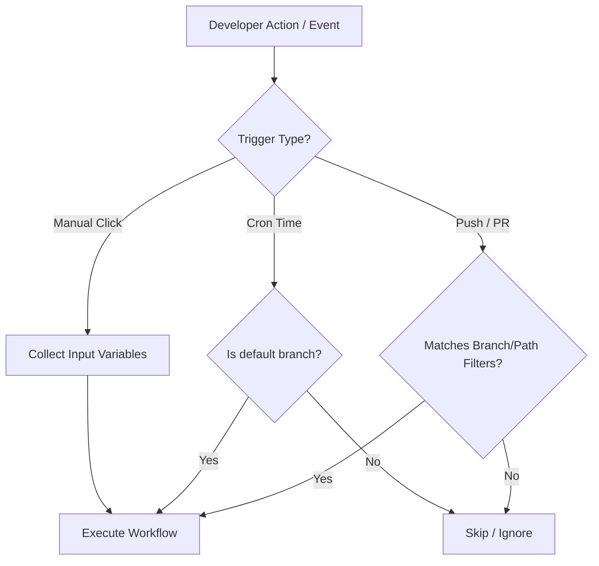

# GitHub Actions Study Notes: Day 2 (5 May 2026)
## Topic: Workflow Triggers, Shell Commands, and Marketplace Actions

In Day 2, we delve deep into execution triggers, the structure of steps, and importing third-party and language-specific actions from the GitHub Marketplace.

---

## 1. Detailed Theory Notes

### Workflow Triggers (`on`)
Workflows do not execute in a vacuum; they require defined triggers. Triggers can be grouped into three major categories:

1. **Webhook Events (Automated)**:
   * `push`: Fires when a commit is pushed to a branch or a tag is created.
   * `pull_request`: Fires when a pull request is created, updated, reopened, or synchronized.
   * *Filtering*: You can restrict execution using filters like `branches`, `branches-ignore`, `tags`, `paths`, and `paths-ignore`.

2. **Scheduled Events (Time-Based)**:
   * `schedule`: Executes workflows automatically at specified times using POSIX crontab syntax.
   * *Cron Syntax*: `cron: 'minute hour day_of_month month day_of_week'` (5 space-separated fields).
   * *Important Caveat*: Scheduled workflows run on the default branch (usually `main`) and can be delayed by GitHub depending on platform load.

3. **Manual Events (User-Initiated)**:
   * `workflow_dispatch`: Enables manual triggering of a workflow through the GitHub Web UI or API. It supports **custom inputs** (strings, booleans, choices) passed by the user.

### Filtering Rules and Git Path Matchers
GitHub Actions uses Glob pattern matching for branches, tags, and file paths:
* `*`: Matches zero or more characters (excluding `/`).
* `**`: Matches zero or more characters recursively across directories.
* `?`: Matches a single character.
* `!`: Negates a pattern (e.g., ignoring changes in documentation files to prevent unnecessary builds).

### Steps: Shell Commands vs. Marketplace Actions
Inside a job, steps represent individual tasks. These are either:
* **Shell Commands (`run`)**: Raw bash, powershell, or cmd commands. They compile code, run CLI utilities, or execute script files.
* **Marketplace Actions (`uses`)**: Prepackaged blocks of code. They can be:
  * *Official Actions*: Created by GitHub (e.g., `actions/checkout`, `actions/setup-java`, `actions/cache`).
  * *Third-Party Actions*: Maintained by community organizations or cloud providers (e.g., `docker/login-action`, `aws-actions/configure-aws-credentials`).

### Language-Specific Setup Actions
To build, test, and compile specific languages, specialized setup actions are used to manage compilers, runtimes, and local package managers (like `npm`, `pip`, or `maven`):
* `actions/setup-node@v4` (Node.js runtime + npm configuration)
* `actions/setup-python@v5` (Python interpreter + pip cache setup)
* `actions/setup-java@v4` (JDK installation + maven/gradle caching support)

---

## 2. Trigger Decision Flow (Mermaid)

The diagram below shows how GitHub Actions evaluates different triggers and path filters before executing a job:



---

## 3. Production-Grade YAML Example

This workflow (`.github/workflows/day2-advanced-triggers.yml`) demonstrates push filters, cron scheduling, and manual triggers with input fields:

```yaml
name: Day 2 - Trigger & Action Showcase

on:
  # Trigger 1: Push events with branch and path filters
  push:
    branches:
      - main
      - 'releases/**' # Matches releases/v1, releases/v2.1
    paths:
      - 'src/**'     # Only trigger if files under src/ are modified
      - '!src/**/*.md' # Do NOT trigger if only markdown files in src/ are changed

  # Trigger 2: Nightly build cron scheduled (Runs at 02:30 AM UTC every day)
  schedule:
    - cron: '30 2 * * *'

  # Trigger 3: Manual dispatch with custom inputs
  workflow_dispatch:
    inputs:
      environment:
        description: 'Target Environment'
        required: true
        default: 'staging'
        type: choice
        options:
          - dev
          - staging
          - production
      run_tests:
        description: 'Execute Test Suite?'
        required: true
        default: true
        type: boolean
      debug_tag:
        description: 'Optional tag for debug release'
        required: false
        type: string

jobs:
  flexible-execution:
    runs-on: ubuntu-latest
    steps:
      # Step 1: Checkout the repo
      - name: Checkout Code
        uses: actions/checkout@v4

      # Step 2: Multi-Language Setup (Node & Python)
      - name: Setup Node.js Environment
        uses: actions/setup-node@v4
        with:
          node-version: '20'

      - name: Setup Python Runtime
        uses: actions/setup-python@v5
        with:
          python-version: '3.11'

      # Step 3: Run shell commands utilizing manual inputs
      - name: Print Manual Input Parameters
        if: github.event_name == 'workflow_dispatch'
        run: |
          echo "==== MANUAL INPUTS RECEIVED ===="
          echo "Deployment Target: ${{ github.event.inputs.environment }}"
          echo "Should Run Tests: ${{ github.event.inputs.run_tests }}"
          echo "Optional Debug Tag: ${{ github.event.inputs.debug_tag }}"

      # Step 4: Conditional test step based on manual inputs
      - name: Run Test Suite
        if: github.event_name != 'workflow_dispatch' || inputs.run_tests == true
        run: |
          echo "Running application tests..."
          python -m unittest discover -s src/tests -p "*.py" || echo "No Python tests found."
```

---

## 4. Practical Exercises

### Exercise 1: Configured Manual Deployment Trigger
1. Create a workflow named `manual-deploy.yml`.
2. Add a manual trigger (`workflow_dispatch`) that accepts two parameters:
   * `app_version` (string, e.g., `1.2.0`)
   * `environment` (choice: `dev`, `qa`, `prod`)
3. Write steps to print: `Deploying application version <app_version> to <environment> environment`.
4. Run this manually from the GitHub Web UI.

### Exercise 2: Path Filtering Laboratory
1. Create a repository with a `src/` directory and a `docs/` directory.
2. Setup a push-triggered workflow that ONLY executes when changes occur within `src/` but does not trigger when files inside `docs/` are pushed.
3. Commit and push files in both directories separately to verify the filter behavior.

---

## 5. Viva Questions (University Exam prep)

**Q1: What is the POSIX Cron representation to run a workflow every Monday at 9:00 AM UTC?**
* **Answer**: `0 9 * * 1` (Minute: 0, Hour: 9, Day of Month: *, Month: *, Day of Week: 1).

**Q2: What is the purpose of the `!` symbol in path filtering?**
* **Answer**: The exclamation mark `!` represents **negation**. It is used to exclude certain paths from triggering a workflow. For example, `!docs/**` prevents commits affecting only documentation files from running the build.

**Q3: Can a scheduled workflow run on branches other than the repository's default branch?**
* **Answer**: No. In GitHub Actions, scheduled cron jobs (`on.schedule`) execute exclusively based on the workflow configuration defined in the **default branch** (usually `main` or `master`).

**Q4: How do you access manual inputs inside a workflow file?**
* **Answer**: Manual inputs are accessed using the context expression `${{ github.event.inputs.<INPUT_NAME> }}` or `${{ inputs.<INPUT_NAME> }}`.

---

## 6. Interview Questions (Placement prep)

**Q1: Explain the difference between `branches` and `branches-ignore` (or `paths` and `paths-ignore`) inside trigger configurations. Can you use both in the same event definition?**
* **Answer**:
  * `branches` specifies a list of allowed branches that *will* trigger the workflow.
  * `branches-ignore` specifies a list of branches that are *excluded* from triggering.
  * **No**, you cannot use both `branches` and `branches-ignore` for the same event in a workflow file. If you need to include and exclude branches simultaneously, use glob matching with negation within `branches` (e.g., `branches: ['**', '!experimental']`).

**Q2: A developer pushed a commit, but the workflow with `workflow_dispatch` did not appear in the GitHub UI Actions tab. What are the common causes?**
* **Answer**:
  1. **Branch mismatch**: The workflow file must exist on the default branch (usually `main`) for GitHub to parse it and display the manual "Run workflow" button in the UI. If it is only on a feature branch, it won't show up.
  2. **YAML Syntax Error**: The workflow file might have structural indentation errors, preventing GitHub from registering the trigger.
  3. **Path mismatch**: The workflow might be placed in a subdirectory other than `.github/workflows/`.

**Q3: How do scheduled workflows handle concurrent executions if a previous scheduled run is still active?**
* **Answer**: By default, GitHub Actions runs scheduled runs in parallel. If a run is slow, the next scheduled trigger will still fire on its interval. If you want to prevent concurrent runs of the same workflow, you must configure a **concurrency group** with cancellation enabled:
  ```yaml
  concurrency:
    group: ${{ github.workflow }}-${{ github.ref }}
    cancel-in-progress: true
  ```

---

## 7. Best Practices

* **Always Specify Branch Filters**: Avoid generic triggers like `on: [push]` on active repositories, as this will spin up runners for every typo fix in feature branches.
* **Keep Cron Intervals Conservative**: Do not schedule workflows to run every minute (`* * * * *`). GitHub may throttle or delay scheduled workflows that run too frequently. Maintain a minimum gap of at least 15-30 minutes.
* **Use Choices for Manual Inputs**: Instead of allowing users to type free-text strings for critical inputs like `environment`, use `type: choice` to limit entries to valid options (e.g., `dev`, `staging`, `prod`) to prevent runtime crashes.

---

## 8. Common Mistakes

* **Crontab 6-field Syntax**: Using Jenkins/Spring-style cron with 6 fields (including seconds). GitHub Actions uses POSIX 5-field crontab. Adding a sixth field results in an invalid trigger parser error.
* **Unescaped Cron Quotes**: Writing `cron: 0 0 * * *` without quotes. Always wrap the cron string in single quotes: `cron: '0 0 * * *'`.
* **Path-filtering Case Sensitivity**: Writing `paths: ['SRC/**']` when the actual directory is lowercase `src/**` will fail to match on Linux systems.

---

## 9. Summary Notes for Last-Minute Revision

* **Webhooks** (`push`, `pull_request`) automate event-driven integration.
* **Cron expression** is `MIN HOUR DOM MON DOW` (UTC time zone only).
* **Manual Trigger** requires `workflow_dispatch` and must reside on the default branch.
* Use **`!`** to ignore specific file changes and save action minutes (e.g., documentation changes).
