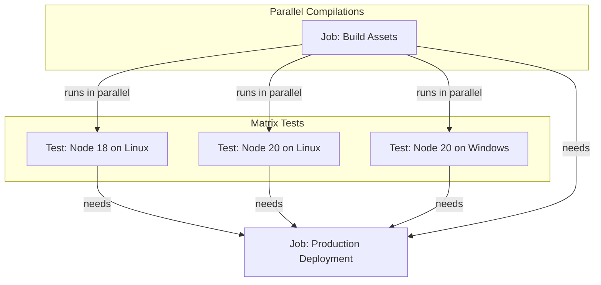

# GitHub Actions Study Notes: Day 3 (6 May 2026)
## Topic: Advanced Jobs, Matrix Strategies, and Caching

Day 3 focuses on running workflows at scale. We explore parallel and sequential job structures, advanced multi-operating system matrix testing strategies, passing output data between jobs, and implementing caching mechanisms to accelerate build cycles.

---

## 1. Detailed Theory Notes

### Multi-Job Workflows: Sequential and Parallel Executions
By default, all jobs listed under `jobs:` in a workflow run **in parallel**. To force sequential execution or form complex execution paths, we use the `needs` keyword to define dependencies.
* **DAG (Directed Acyclic Graph)**: With `needs`, you can create a non-linear flow. For example, a `deploy` job can be configured to run only if *both* the `build` and `test` jobs complete successfully.
* **Execution Status Evaluation**: If a dependent job fails, downstream jobs are skipped automatically unless conditional checks (like `if: always()`) are explicitly set.

### Passing Data Between Jobs
Jobs run on entirely different runner VMs. They do not share a local filesystem. If Job B requires compiled files or variables produced in Job A, you must use one of these two methods:
1. **Workflow Artifacts (`actions/upload-artifact` & `actions/download-artifact`)**: Best for large physical files like compiled binaries, zip archives, or test coverage reports.
2. **Job Outputs (`outputs`)**: Best for simple variables, configuration strings, or tags (e.g., passing a dynamically generated version tag from a build job to a deployment job).

### Matrix Strategies
A matrix strategy (`jobs.<job_id>.strategy.matrix`) lets you automatically create multiple jobs based on combinations of variables.
* **Combinatorics**: Defining `node-version: [18, 20]` and `os: [ubuntu-latest, windows-latest]` will trigger **4 distinct jobs** running concurrently.
* **`include`**: Adds specific additional combinations (e.g., adding an older Node version only on a specific OS, or adding extra configuration variables to a specific matrix item).
* **`exclude`**: Removes specific combinations from the matrix (e.g., omitting legacy configurations on modern operating systems).
* **Fail-Fast (`fail-fast`)**: By default, `fail-fast: true`. If one job in the matrix fails, GitHub immediately cancels all other active and queued matrix jobs in that run. Setting it to `false` ensures all configurations run to completion, which is standard for comprehensive test suites.

### Build Caching
Software projects download massive packages (e.g., `node_modules`, python `site-packages`, maven `.m2` repository) during every build. Re-downloading these packages on clean runner VMs wastes time and network bandwidth.
* **`actions/cache@v4`**: Saves these directories after a successful build and restores them in subsequent runs if a match is found.
* **Cache Key**: A unique string used to identify the cache. Usually contains the OS name and a cryptographic hash of package lockfiles (e.g., `package-lock.json`, `requirements.txt`).
  * *Formula*: `key: ${{ runner.os }}-node-${{ hashFiles('**/package-lock.json') }}`
  * If the lockfile changes, the hash changes, resulting in a cache miss, forcing a fresh download and creating a new cache.
* **Restore Keys**: A list of backup keys to use if an exact match isn't found. This restores the closest older cache, speeding up the installation of unmodified dependencies.
* **Eviction Policy**: GitHub automatically evicts caches that have not been accessed for **7 days**. The total storage limit is **10 GB per repository**; exceeding this causes older caches to be deleted (FIFO).

---

## 2. Execution Workflows (Mermaid)

### Multi-Job DAG Dependency Graph
This diagram shows a standard build, test, and release cycle. The `Deployment` job is blocked until all build and test matrices complete successfully.



---

## 3. Production-Grade YAML Example

This workflow (`.github/workflows/day3-matrix-caching.yml`) demonstrates dependency caching, parallel testing across operating systems/runtimes using a matrix strategy, and passing metadata to a sequential deployment job:

```yaml
name: Day 3 - Enterprise Matrix & Cache CI

on:
  push:
    branches: [main]

jobs:
  # Job 1: Build & Package application
  compile-and-package:
    runs-on: ubuntu-latest
    # Define outputs to pass to the deployment job
    outputs:
      build_tag: ${{ steps.set-version.outputs.tag }}
    steps:
      - name: Checkout
        uses: actions/checkout@v4

      - name: Set up Node.js
        uses: actions/setup-node@v4
        with:
          node-version: '20'

      # Step 3: Implement Build Caching
      - name: Cache Node Modules
        id: npm-cache
        uses: actions/cache@v4
        with:
          path: ~/.npm
          key: ${{ runner.os }}-build-node-modules-${{ hashFiles('**/package-lock.json') }}
          restore-keys: |
            ${{ runner.os }}-build-node-modules-

      - name: Install Dependencies
        run: npm ci

      - name: Compile Distribution Assets
        run: |
          mkdir -p dist
          echo "Production Ready Binary Assets" > dist/app.bin

      # Step 5: Upload build artifact
      - name: Archive Production Assets
        uses: actions/upload-artifact@v4
        with:
          name: compiled-assets
          path: dist/

      # Step 6: Define and set job output variable
      - name: Generate Custom Version Tag
        id: set-version
        run: |
          VERSION="v1.0.$(date +%Y%m%d%H%M%S)"
          echo "tag=$VERSION" >> "$GITHUB_OUTPUT"

  # Job 2: Run test suite across multiple platforms concurrently
  test-matrix:
    needs: compile-and-package
    runs-on: ${{ matrix.os }}
    strategy:
      fail-fast: false # Run all matrix combinations even if one fails
      matrix:
        os: [ubuntu-latest, windows-latest]
        node-version: [18, 20]
        # Include custom configuration for specific combination
        include:
          - os: ubuntu-latest
            node-version: 20
            experimental_flag: true
        # Exclude old node version on Windows
        exclude:
          - os: windows-latest
            node-version: 18

    name: Test on ${{ matrix.os }} (Node ${{ matrix.node-version }})
    steps:
      - name: Checkout
        uses: actions/checkout@v4

      - name: Setup Node
        uses: actions/setup-node@v4
        with:
          node-version: ${{ matrix.node-version }}

      - name: Restore Cache for Testing
        uses: actions/cache@v4
        with:
          path: ~/.npm
          key: ${{ runner.os }}-test-node-modules-${{ hashFiles('**/package-lock.json') }}

      - name: Install dependencies
        run: npm ci

      - name: Execute Tests
        run: npm test || echo "Tests running in mock mode."

  # Job 3: Sequential deployment execution
  deploy-production:
    # Requires BOTH preceding jobs to succeed
    needs: [compile-and-package, test-matrix]
    runs-on: ubuntu-latest
    steps:
      - name: Download Build Assets
        uses: actions/download-artifact@v4
        with:
          name: compiled-assets
          path: downloaded-dist/

      - name: Execute Deploy Command
        run: |
          echo "==== PRODUCTION DEPLOYMENT ===="
          echo "Retrieved Build Tag: ${{ needs.compile-and-package.outputs.build_tag }}"
          echo "Contents of downloaded binary:"
          cat downloaded-dist/app.bin
          echo "Deploying successfully..."
```

---

## 4. Practical Exercises

### Exercise 1: Multi-Job Build & Artifact Pipeline
1. Create a workspace with a dummy project (e.g. static HTML page).
2. Configure Job 1 (`build`): Use shell scripts to write build metadata into `dist/metadata.txt`. Use `actions/upload-artifact` to archive the `dist` directory.
3. Configure Job 2 (`release`): Set `needs: build`. Use `actions/download-artifact` to pull the compiled assets and print the contents of `metadata.txt`.
4. Validate that the files transfer correctly between the clean runner VMs.

### Exercise 2: OS Matrix Test Grid
1. Write a testing workflow containing a matrix running on three operating systems: `ubuntu-latest`, `macos-latest`, and `windows-latest`.
2. Configure steps that execute a system command unique to each OS:
   * Bash script for Linux/macOS.
   * PowerShell command for Windows.
3. Handle platform differences cleanly using the `matrix.os` context variables.

---

## 5. Viva Questions (University Exam prep)

**Q1: What does `fail-fast: false` represent inside a matrix strategy block?**
* **Answer**: It specifies that even if one combination in the matrix fails, GitHub Actions should **not** cancel the other currently active or queued matrix jobs. This is useful to collect complete test logs across all environments.

**Q2: Why can't Jobs share files directly by writing to local runner folders?**
* **Answer**: Because each Job is assigned to and runs on a **completely separate, isolated virtual machine instance (Runner)**. Once a job completes, its virtual machine is destroyed.

**Q3: How do you declare that Job C must wait for the successful completion of Job A and Job B?**
* **Answer**: By adding the `needs` keyword in Job C's block: `needs: [JobA, JobB]`.

**Q4: What is the benefit of using `restore-keys` in `actions/cache`?**
* **Answer**: If an exact cache match (based on the primary key) does not exist, `restore-keys` provides a fallback prefix search. The runner can then download the most recent previous cache, updating only the files that changed since that cache was created.

---

## 6. Interview Questions (Placement prep)

**Q1: How do you design a workflow where Job B runs if Job A succeeds, but Job C runs only if Job A fails? Explain how to implement this conditional DAG logic.**
* **Answer**: You implement this using a combination of the `needs` keyword and the `if` execution condition:
  * For Job B:
    ```yaml
    needs: JobA
    ```
    (Runs automatically only on success of JobA).
  * For Job C:
    ```yaml
    needs: JobA
    if: failure()
    ```
    The `failure()` function evaluates to true if any required dependency fails. This instructs the runner to execute Job C only if Job A fails.

**Q2: What are the cache storage limitations in GitHub Actions, and what happens when you exceed the allocated storage limit?**
* **Answer**:
  * The storage limit is **10 GB per repository**.
  * If the total size of all caches in a repository exceeds 10 GB, GitHub Actions will evict older caches using a **First-In, First-Out (FIFO)** strategy, deleting the oldest unused cache to make space for the new one. Caches older than **7 days** without access are automatically deleted.

**Q3: Explain the `hashFiles` function. Why is it used in cache keys instead of hardcoded strings?**
* **Answer**: `hashFiles` is a built-in runner function that computes a SHA-256 hash of a single file or a glob pattern of files (e.g., `package-lock.json`).
  Using `hashFiles` in cache keys guarantees that if a dependency is added, removed, or updated, the lockfile changes, creating a **new unique cache key**. This forces a cache-miss, downloading the new dependencies, and caching the updated directory without using stale cache files.

---

## 7. Best Practices

* **Always Cache Dependencies**: Implement dependency caching (`actions/cache` or setup action caching built-ins) for all builds. It can cut pipeline execution times by 50% to 70%.
* **Prune Artifacts Expiry**: Set `retention-days` on uploaded artifacts (e.g., `retention-days: 5`) to prevent storing unnecessary large builds for the default 90 days.
* **Keep Matrix Clean**: Avoid massive, redundant combinations. Use the `exclude` block to filter out useless test matrix variations (e.g., testing old development dependencies on expensive macOS runners).

---

## 8. Common Mistakes

* **Incorrect Cache Path**: Caching a directory that doesn't exist on the runner OS (e.g., configuring `node_modules` instead of the global npm cache path `~/.npm` on Linux, which can lead to extraction issues).
* **Missing outputs block declaration**: Trying to reference a step output in a downstream job (e.g., `needs.job1.outputs.var`) without first defining it in the job-level `outputs` configuration block.
* **Circular Dependencies**: Defining circular dependencies (e.g., Job A needs Job B, and Job B needs Job A). The workflow engine will fail validation and refuse to execute.

---

## 9. Summary Notes for Last-Minute Revision

* **DAG Dependencies**: `needs: [jobA, jobB]` schedules sequential blocks.
* **Outputs**: Pass metadata via `echo "key=value" >> $GITHUB_OUTPUT` + Job-level `outputs` definition.
* **Matrix Strategy**: Generates multiple job configurations. `fail-fast: false` ensures exhaustive test coverage.
* **Build Cache**: Keys must use `runner.os` and `hashFiles('lockfile')` for dynamic cache validation.
