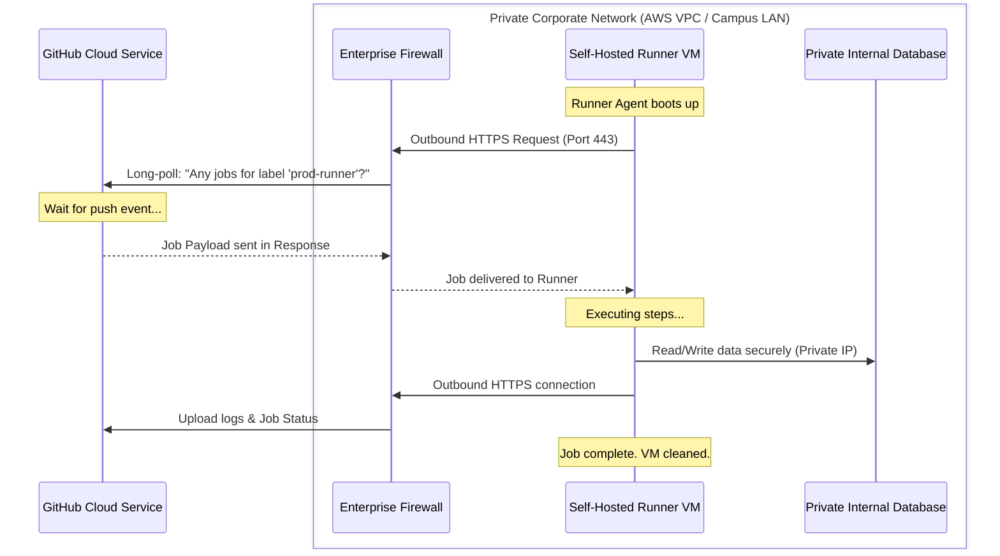

# GitHub Actions Study Notes: Day 4 (7 May 2026)
## Topic: GitHub-Hosted vs. Self-Hosted Runners and Security

Day 4 addresses the execution engine: Runners. We compare GitHub's cloud-hosted infrastructure against private Self-Hosted runners, examine secure system networking, and discuss crucial security protocols for production pipelines.

---

## 1. Detailed Theory Notes

### GitHub-Hosted Runners
GitHub-hosted runners are virtual machines managed directly by GitHub.
* **VM Isolation**: Each job runs on a brand-new, clean virtual machine instance. Once the job completes, the VM is instantly destroyed, ensuring no cross-contamination or residual state between runs.
* **Pre-installed Software**: They come loaded with hundreds of standard developer packages (Git, Docker, Java, Python, Node, GCC, AWS CLI, etc.).
* **Compute Capabilities**: Default environments run on standard VM sizes (typically 2 vCPUs, 7 GB RAM, and 14 GB SSD storage). High-compute (larger) runners are available for enterprise accounts.
* **Cons**: Build times can be slower due to cold-starts and clean workspaces, and pricing is calculated per execution minute.

### Self-Hosted Runners
Self-hosted runners are physical machines, containers, or virtual machines that you provision, configure, and maintain yourself.
* **Persistent Filesystem**: The workspace directory is persistent between jobs. This speeds up builds (as libraries are already present) but risks state pollution if steps leave behind processes or files.
* **Custom Hardware**: You can deploy runners on bare-metal servers, GPUs (for ML workloads), or ARM64 architectures (e.g., AWS Graviton).
* **Private Network Access**: Because the runner resides within your infrastructure (e.g., AWS VPC or local campus server), it can securely access private databases, Kubernetes clusters, or internal staging servers without exposing them to the internet.

### Network Architecture and Security of Self-Hosted Runners
A common misconception is that a self-hosted runner requires opening inbound firewall ports (like port 80 or 443) so GitHub can send jobs to it.
* **Long Polling Protocol**: The runner agent software uses a secure outbound HTTPS connection (`port 443`) to poll GitHub's API servers.
* **No Inbound Open Ports**: The runner connects outward. This outbound long poll waits for a job to be assigned. When a job is received, it is processed locally, and logs are streamed back over the same outbound HTTPS connection.
* **The Public Repo Danger**: **Never use self-hosted runners on public repositories.** If a repository is public, a malicious actor can open a Pull Request modifying the `.github/workflows/` files to run arbitrary code. This code would execute directly on your private server, potentially stealing environment secrets or scanning your private corporate network.

### Ephemeral Runners
To mimic the clean-slate security of GitHub-hosted runners, you can configure self-hosted runners in **ephemeral mode** (using the `--ephemeral` flag during configuration).
* An ephemeral runner processes exactly **one job** and then immediately terminates the runner agent service.
* Orchestration systems (like Kubernetes with actions-runner-controller) can automatically spin down the dead pod and spin up a clean one, maintaining enterprise security.

---

## 2. Network Security Architecture (Mermaid)

The architecture diagram below demonstrates how a self-hosted runner communicates safely with GitHub via outbound long-polling without exposing internal systems:



---

## 3. Production-Grade YAML Example

This workflow (`.github/workflows/day4-self-hosted.yml`) demonstrates how to target a customized self-hosted runner group using custom tags, and run a secure build with limited scope:

```yaml
name: Day 4 - Enterprise Private Deployment

on:
  push:
    branches: [main]

jobs:
  deploy-to-private-network:
    # Target a self-hosted runner with specific labels
    runs-on: [self-hosted, linux, x64, prod-runner]
    
    # Restrict permissions of GITHUB_TOKEN
    permissions:
      contents: read
      id-token: write # Required for secure OIDC cloud logins

    steps:
      - name: Checkout Code
        uses: actions/checkout@v4

      # Step 2: Use mask command to protect sensitive data in logs
      - name: Configure Logging Security Mask
        run: |
          echo "==== SECURING LOG SYSTEM ===="
          # Mask string values so they appear as *** in runner logs
          echo "::add-mask::MY_SECRET_DB_PASSWORD_123"
          echo "DB_PASS=MY_SECRET_DB_PASSWORD_123" >> $GITHUB_ENV

      # Step 3: Run internal deployment command
      - name: Update Staging Database Schema
        run: |
          echo "Accessing private database using internal DNS name..."
          echo "Target Database: db.staging.internal-domain.local"
          # The password variable printed below will show up as *** in logs
          echo "Authenticating using password: $DB_PASS"
          echo "Schema update completed successfully."

      # Step 4: System Cleanup (Crucial for non-ephemeral self-hosted runners!)
      - name: Workspace Post-Execution Cleanup
        if: always() # Run even if previous steps fail
        run: |
          echo "Cleaning build workspace to prevent state contamination..."
          rm -rf ${{ github.workspace }}/*
```

---

## 4. Practical Exercises

### Exercise 1: Simulate Self-Hosted Runner Installation
1. Create a dummy test repository on GitHub.
2. Go to **Settings** -> **Actions** -> **Runners** -> **New self-hosted runner**.
3. Choose your OS (Linux/Windows/macOS).
4. Follow the download and configuration steps on a local test VM or computer:
   * Download the runner package.
   * Extract it.
   * Run `./config.sh --url https://github.com/YOUR_USER/YOUR_REPO --token YOUR_TOKEN --labels local-testing`.
5. Run the agent using `./run.sh`.
6. Verify the runner shows as **Idle** (Green) in the GitHub Settings UI.
7. Write a simple workflow targeting `runs-on: local-testing` and run it to verify execution on your local machine.

### Exercise 2: State Contamination Demonstration
1. Create a workflow targeting a persistent self-hosted runner.
2. In Job 1, write a file containing static data inside `/tmp/contamination.txt` or a local file.
3. Push a second commit with a workflow that *does not* write the file, but tries to read it.
4. Observe how the state is preserved across runs, demonstrating why cleanup steps (`if: always()`) or ephemeral runner setups are critical.

---

## 5. Viva Questions (University Exam prep)

**Q1: How do Self-Hosted Runners fetch jobs from GitHub servers? Do they require inbound ports open?**
* **Answer**: No inbound firewall ports need to be opened. The self-hosted runner agent utilizes **outbound long-polling** over HTTPS (port 443) to safely request and retrieve jobs from GitHub.

**Q2: What is the main security hazard of enabling self-hosted runners on a public repository?**
* **Answer**: A malicious user can submit a Pull Request containing modified workflows that execute arbitrary code. This code runs directly on your self-hosted runner machine, potentially compromising your private infrastructure, network, and secrets.

**Q3: How do you target a specific self-hosted runner inside a workflow?**
* **Answer**: By specifying the labels assigned to that runner inside the `runs-on` array, e.g., `runs-on: [self-hosted, linux, prod-cluster]`.

**Q4: What is an Ephemeral Runner?**
* **Answer**: An ephemeral runner is configured to process exactly one job and then automatically shut down. This prevents configuration drift and prevents malicious steps from contaminating subsequent builds.

---

## 6. Interview Questions (Placement prep)

**Q1: Explain how you would safely manage secret rotation and secure credentials in a hybrid CI/CD pipeline using OpenID Connect (OIDC) instead of static tokens.**
* **Answer**: Instead of storing long-lived, static access keys (like AWS Access Keys) as GitHub Actions secrets (which can leak or expire), you configure **OpenID Connect (OIDC)**.
  The workflow requests a short-lived JSON Web Token (JWT) from GitHub's OIDC provider using `id-token: write` permissions. It exchanges this JWT with the cloud provider (e.g., AWS STS) for a temporary session token (valid for e.g. 15 minutes) that has strict permissions. This eliminates static secret management entirely.

**Q2: How do you address the scenario where a self-hosted runner's build crashes and leaves behind orphaned background processes that consume CPU and RAM?**
* **Answer**:
  1. Use containerized runners where the entire container is destroyed after the job completes (ephemeral architecture).
  2. Implement a strict **cleanup step** at the end of the workflow utilizing `if: always()` to kill processes.
  3. Configure the runner to run inside a clean Docker container per job, preventing persistent system impact.

**Q3: What are Runner Groups, and how do they help manage infrastructure in an enterprise environment?**
* **Answer**: Runner groups are security boundaries used to manage sets of runners. Instead of sharing runners globally, you group them (e.g., `payment-gateway-runners`). You can then restrict these groups so they can only be used by specific private repositories, preventing unauthorized workflows from running on high-security machines.

---

## 7. Best Practices

* **Enforce Ephemeral Mode**: Always configure production self-hosted runners with the `--ephemeral` flag to guarantee clean execution environments.
* **Lock Down Token Scope**: Always set explicit minimum `permissions` at the top of your workflow files (e.g., `permissions: contents: read`) to prevent credential leaks.
* **Isolate Network Routing**: Place self-hosted runners in highly restricted, isolated subnets. Do not allow them unrestricted access to the entire corporate or campus network.

---

## 8. Common Mistakes

* **Label Mismatch Queueing**: Specifying tags that do not exactly match any registered runner (e.g. `runs-on: [self-hosted, ubunto-latest]`). The workflow will hang in the "Queued" state indefinitely without throwing a syntax error.
* **No Workspace Cleanup**: Failing to clean the workspace directory on persistent runners. Leftover files can cause disk space exhaustion or lead to hard-to-debug compilation issues on subsequent runs.
* **Running as Root**: Installing and running the runner agent package as the root user. If compromised, a malicious workflow will gain full root access to the underlying server host.

---

## 9. Summary Notes for Last-Minute Revision

* **GitHub-Hosted**: High isolation, zero maintenance, billing per minute.
* **Self-Hosted**: Persistent filesystem, custom compute, internal network access, requires manual security.
* **Outbound Only**: Communication is pull-based (long polling HTTPS on port 443). No open inbound ports required.
* **OIDC**: Standard for modern cloud credential exchange, replacing static access tokens.
