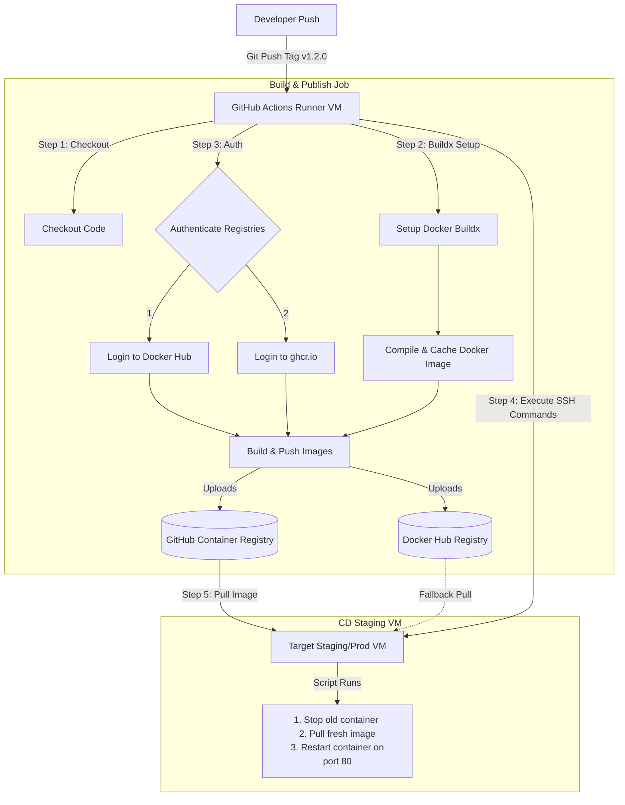

# GitHub Actions Study Notes: Day 5 (8 May 2026)
## Topic: Containerized CI/CD (Docker, GHCR, Docker Hub) and Deployments

On Day 5, we culminate our syllabus with the ultimate modern industry standard: containerized CI/CD. We learn how to compile Docker images in GitHub Actions, publish them to both Docker Hub and GitHub Container Registry (GHCR), and trigger remote cloud deployments using SSH orchestration.

---

## 1. Detailed Theory Notes

### Containerized CI/CD Workflow Lifecycle
In modern microservices architectures, the build output is rarely raw code; it is a compiled **Docker Container Image** package conforming to the Open Container Initiative (OCI) specification.
The pipeline follows a distinct 4-stage lifecycle:
1. **Source**: Developer pushes code to the repository.
2. **Build & Test**: Code is checked out and compiled. A local Docker build verifies the Dockerfile structure.
3. **Publish**: The image is compiled, tagged with semantic versioning (e.g., `1.0.0`, `latest`), and pushed to an external Container Registry.
4. **Deploy**: The pipeline triggers a deployment script on a remote server/cloud platform. The server pulls the fresh image from the registry and restarts the container.

### Container Registries: Docker Hub vs. GHCR
A Container Registry is a host hosting compiled container images.

| Feature | Docker Hub (`docker.io`) | GitHub Container Registry (GHCR - `ghcr.io`) |
| :--- | :--- | :--- |
| **Namespace Format** | `docker.io/<username>/<image-name>` | `ghcr.io/<username-lowercase>/<image-name>` |
| **Authentication in GHA** | Requires custom Repository Secrets (`DOCKER_USER`, `DOCKER_PAT`). | Uses the built-in, automatic repository variable `${{ secrets.GITHUB_TOKEN }}`. |
| **Network Proximity** | Separate external network call. | Internal GitHub network (faster speeds, zero data transfer cost for GHA). |
| **Pricing (Public/Private)**| Limited private repos on free tier. | Free public images; generous free private tier. |

### Docker Buildx and CI Caching
Building Docker images inside a fresh CI VM from scratch is slow.
* **Docker Buildx**: A Docker CLI plugin that enables advanced features like multi-architecture builds (AMD64, ARM64) and advanced cache exports.
* **CI Cache Backend (`gha` cache type)**: Exports Docker build cache layers directly to the GitHub Actions cache service. During subsequent builds, Docker only downloads the layers that changed, reducing build times from minutes to seconds.

---

## 2. Complete End-to-End CI/CD Pipeline (Mermaid)

The diagram below shows the entire automated flow of code compilation, dual-registry image distribution, and secure remote deployment:



---

## 3. Production-Grade YAML Example

This production-grade pipeline (`.github/workflows/day5-container-deploy.yml`) automates building a Docker image, caching layers, pushing it to **both** Docker Hub and GHCR simultaneously, and then SSHing into a staging server to deploy:

```yaml
name: Day 5 - Multi-Registry Container CD

on:
  push:
    # Trigger on semantic version tags (e.g., v1.0.0, v2.1.3)
    tags:
      - 'v*'

# Set minimum required permissions for GHCR pushes
permissions:
  contents: read
  packages: write

jobs:
  # Job 1: Compile and Publish Container Images
  build-and-publish:
    runs-on: ubuntu-latest
    steps:
      - name: Checkout Code
        uses: actions/checkout@v4

      # Step 2: Set up QEMU for multi-platform support
      - name: Set up QEMU
        uses: docker/setup-qemu-action@v3

      # Step 3: Set up Docker Buildx (Essential for GHA layer caching)
      - name: Set up Docker Buildx
        uses: docker/setup-buildx-action@v3

      # Step 4: Login to Docker Hub using secrets
      - name: Login to Docker Hub
        uses: docker/login-action@v3
        with:
          username: ${{ secrets.DOCKERHUB_USERNAME }}
          password: ${{ secrets.DOCKERHUB_TOKEN }}

      # Step 5: Login to GitHub Container Registry (GHCR) using GITHUB_TOKEN
      - name: Login to GHCR
        uses: docker/login-action@v3
        with:
          registry: ghcr.io
          username: ${{ github.actor }}
          password: ${{ secrets.GITHUB_TOKEN }}

      # Step 6: Generate metadata (tags, labels) automatically
      - name: Extract Docker Metadata
        id: meta
        uses: docker/metadata-action@v5
        with:
          images: |
            danishanwar/my-awesome-app
            ghcr.io/${{ github.repository_owner }}/my-awesome-app
          tags: |
            type=semver,pattern={{version}}
            type=raw,value=latest

      # Step 7: Compile, Cache, and Push Docker Image
      - name: Build and Push Docker Image
        uses: docker/build-push-action@v5
        with:
          context: .
          file: ./Dockerfile
          push: true
          platforms: linux/amd64
          tags: ${{ steps.meta.outputs.tags }}
          labels: ${{ steps.meta.outputs.labels }}
          # Export/Import layers cache using GHA cache backend
          cache-from: type=gha
          cache-to: type=gha,mode=max

  # Job 2: Secure Remote Deployment via SSH
  deploy-to-server:
    needs: build-and-publish
    runs-on: ubuntu-latest
    steps:
      # Execute commands on remote target server using SSH
      - name: Execute Remote SSH Deploy
        uses: appleboy/ssh-action@v1.0.3
        with:
          host: ${{ secrets.STAGING_SERVER_IP }}
          username: ${{ secrets.STAGING_SERVER_USER }}
          key: ${{ secrets.STAGING_SSH_PRIVATE_KEY }}
          port: 22
          script: |
            echo "==== REMOTELY DEPLOYING CONTAINER ===="
            # Authenticate remote machine with GHCR to pull private image
            echo "${{ secrets.GITHUB_TOKEN }}" | docker login ghcr.io -u ${{ github.actor }} --password-stdin
            
            # Stop any existing container running on the same port
            docker stop my-app-running || true
            docker rm my-app-running || true
            
            # Pull the fresh image that was just pushed by Job 1
            docker pull ghcr.io/${{ github.repository_owner }}/my-awesome-app:latest
            
            # Start the container
            docker run -d \
              -p 8080:80 \
              --name my-app-running \
              --restart unless-stopped \
              ghcr.io/${{ github.repository_owner }}/my-awesome-app:latest
            
            echo "Deployment successfully executed!"
```

---

## 4. Practical Exercises

### Exercise 1: Multi-Stage Dockerfile Compilation
1. Write a lightweight Go or Node.js application.
2. Design a **Multi-Stage Dockerfile** to minimize the output image footprint:
   * *Stage 1 (Build)*: Use a heavy developer image (e.g. `node:20` or `golang:1.21`) to download packages and compile the application binaries.
   * *Stage 2 (Production Run)*: Copy *only* the compiled assets into a minimal runtime base image (e.g. `alpine:latest` or `gcr.io/distroless/static`).
3. Write a GitHub Actions workflow to build this image, printing the size difference between a single-stage build and your multi-stage build.

### Exercise 2: GHCR Authentication & Push Labs
1. Create a public repository on GitHub.
2. Add a simple Dockerfile.
3. Write a workflow that logs into `ghcr.io` utilizing the automatic `${{ secrets.GITHUB_TOKEN }}`.
4. Push the image with the tag `latest`.
5. Verify the package is linked successfully to your GitHub repository UI under the "Packages" section.

---

## 5. Viva Questions (University Exam prep)

**Q1: What registry host URL must be used to authenticate and push images to GitHub Container Registry?**
* **Answer**: `ghcr.io`.

**Q2: What is the benefit of a Multi-stage Dockerfile in CI/CD pipeline environments?**
* **Answer**: It separates the compilation environment (heavy dependency tools) from the runtime environment (minimal footprint). This significantly reduces the size of the final Docker image, which speeds up network transfer, lowers storage costs, and reduces the attack surface for security vulnerabilities.

**Q3: How do we authenticate with GHCR inside GitHub Actions without creating a personal access token (PAT)?**
* **Answer**: We authenticate utilizing the built-in, automatically generated `${{ secrets.GITHUB_TOKEN }}` which has write access to the registry when the workspace has correct permissions (`packages: write`).

**Q4: What is the purpose of `docker/setup-buildx-action`?**
* **Answer**: It configures Docker Buildx, an extension that enables advanced build capabilities like multi-architecture image packaging and exporting cache layers directly to GitHub Actions.

---

## 6. Interview Questions (Placement prep)

**Q1: How does Docker Layer Caching work inside GitHub Actions, and how do we configure it using the `docker/build-push-action`?**
* **Answer**:
  By default, every GitHub Actions runner starts as a clean VM, meaning local Docker build caches are lost. To preserve layer caches across runs, we use the `gha` cache backend.
  We configure this inside the `docker/build-push-action` using:
  ```yaml
  cache-from: type=gha
  cache-to: type=gha,mode=max
  ```
  This exports the build layers to GitHub Actions' cache storage. On subsequent runs, it imports the unchanged layers, significantly accelerating the build process.

**Q2: When deploying containers via SSH (`appleboy/ssh-action`), if the target VM is inside a private VPC and blocked from public ingress, how can your GHA runner connect to it?**
* **Answer**:
  1. **Self-Hosted Runner**: Run the GHA job on a self-hosted runner deployed inside the same VPC or private network as the target VM.
  2. **Tailscale / VPN**: Use a workflow step to establish a temporary secure VPN tunnel (e.g., WireGuard or Tailscale) from the GitHub-hosted runner to the VPC before running the SSH action.
  3. **IP Whitelisting**: Use actions that fetch the current public IP of the runner and dynamically add it to the cloud provider's firewall security group, removing it immediately after deployment completion.

**Q3: Explain the difference between `GITHUB_TOKEN` and a Personal Access Token (PAT) when pushing to GHCR.**
* **Answer**:
  * `GITHUB_TOKEN` is scoped to the **specific repository** hosting the workflow and is dynamically generated for that specific run, expiring immediately when the job finishes. It is highly secure and follows the principle of least privilege.
  * A Personal Access Token (PAT) is tied to a **specific user account** and has global access to all repositories and packages owned by that user. PATs are persistent and pose a higher security risk if leaked. Use `GITHUB_TOKEN` whenever possible.

---

## 7. Best Practices

* **Use Multi-Stage Builds**: Keep production containers minimal. Do not ship compilers, debuggers, or package manager files in production images.
* **Leverage Docker Layer Caching**: Always enable cache-from and cache-to with `type=gha` to save action minutes.
* **Avoid `latest` Tag in Production**: Always tag production containers with a specific, immutable version identifier (e.g., Git commit SHA or semantic version tag `v1.2.3`). Using `latest` makes rollback difficult and can lead to unexpected version upgrades.

---

## 8. Common Mistakes

* **Incorrect Registry Namespace Casing**: GHCR requires the namespace owner to be **entirely lowercase**. Pushing to `ghcr.io/MyGitHubOrg/image` instead of `ghcr.io/mygithuborg/image` will fail authentication.
* **Missing `packages: write` Permissions**: Trying to push to GHCR using `GITHUB_TOKEN` without specifying the explicit permission block `permissions: packages: write` in the workflow file.
* **Dangling Container Clean Failures**: Trying to spin up a new container using the same `--name` as a running container without stopping and removing it first, which results in deployment crashes.

---

## 9. Summary Notes for Last-Minute Revision

* **GHCR Host**: `ghcr.io`. Authenticate using `${{ secrets.GITHUB_TOKEN }}`.
* **Docker Hub Host**: `docker.io` (implicit). Authenticate using custom secrets.
* **Build Cache**: Enable `cache-from: type=gha` and `cache-to: type=gha,mode=max` inside `docker/build-push-action`.
* **Deployments**: Use `appleboy/ssh-action` to connect to staging/production VMs, pull the updated container image, and restart the service safely.
