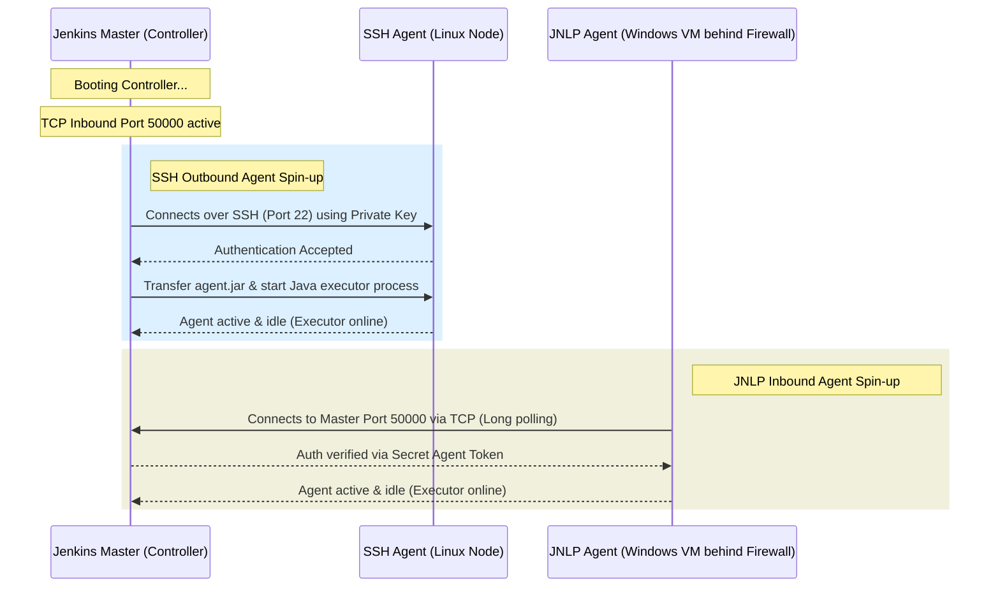

# Jenkins Study Notes: Day 1 (11 May 2026)
## Topic: Jenkins Foundations, Distributed Architecture, and Security

Welcome to Day 1 of the Jenkins Intensive Study Program. These notes are designed at a university practical exam + placement preparation level, covering core concepts, architectural models, and corporate enterprise security setups.

---

## 1. Detailed Theory Notes

### What is Jenkins?
Jenkins is an open-source, extensible automation server written in Java. It is the industry-pioneer tool for **Continuous Integration (CI) and Continuous Deployment (CD)**, allowing developers to automate building, testing, and deploying software projects.
* **Core Strength**: Extensibility. Jenkins has over 1,800+ community-contributed plugins, allowing it to integrate with virtually any tool in the DevOps stack (Git, Docker, Kubernetes, Maven, AWS, etc.).

### Jenkins Distributed Architecture (Master/Agent Model)
In a production DevOps environment, running all compilation, test suites, and container builds on a single Jenkins server is highly discouraged (it leads to CPU exhaustion, memory crashes, and security risks). Instead, Jenkins implements a **Master/Agent distributed architecture**:

```
 ┌──────────────────────────────────────────┐
 │             Jenkins Master               │
 │ (Scheduler, UI, Plugins, API, Secrets)   │
 └────────────────────┬─────────────────────┘
                      │
         ┌────────────┴────────────┐
         ▼                         ▼
 ┌───────────────┐         ┌───────────────┐
 │ Jenkins Agent │         │ Jenkins Agent │
 │  (Windows VM) │         │  (Linux VM)   │
 └───────────────┘         └───────────────┘
```

1. **Jenkins Master (Controller)**:
   * Serves the Web Dashboard UI.
   * Manages the configuration, system settings, and environment properties.
   * Handles user authentication and access authorization.
   * Schedules builds and dispatches the execution steps to the configured Agents.
   * **Note**: It does *not* execute build steps itself in production (configured to have 0 executors).

2. **Jenkins Agents (Workers / Nodes)**:
   * Lightweight Java processes (`agent.jar`) running on separate physical, virtual, or containerized hosts.
   * Listens for instructions from the Master, executes the assigned build steps, and streams execution logs back in real-time.
   * Can run different operating systems (Linux, Windows, macOS) to compile platform-specific builds.

### Agent Connection Topologies
Jenkins Agents connect to the Master using two primary methods:
* **SSH connection (Outbound from Master)**: The Master connects to the Agent VM using SSH (default port 22) using a private key credential. The Master automatically pushes the `agent.jar` file and spins up the agent process. This is the preferred method for Linux-based agents.
* **Inbound Connection (JNLP / TCP)**: The Agent machine connects *inward* to the Master over a designated TCP port (e.g. 50000) using the Java Network Launch Protocol (JNLP). This is preferred for Windows-based nodes or agents operating inside isolated private subnets behind firewalls.

### Plugins Management
Plugins extend Jenkins' core capabilities.
* **Plugin Lifecycle**: Installed plugins reside in the `$JENKINS_HOME/plugins/` directory. Upgrades can be performed dynamically via the **Plugin Manager** interface, followed by a graceful restart.
* **Plugin Failures**: A corrupted plugin update can prevent Jenkins from booting. Administrators can recover by deleting the corresponding `.hpi` or `.jpi` file under `$JENKINS_HOME/plugins/` via the host command line and restarting the service.

### Jenkins Enterprise Security & Access Control
Jenkins security is split into two major boundaries:
1. **Authentication (Who are you?)**:
   * Authenticating users using the internal Jenkins database, LDAP (Lightweight Directory Access Protocol), Active Directory (AD), or Single Sign-On (SAML/OIDC).
2. **Authorization (What can you do?)**:
   * *Matrix Authorization*: A detailed permission table where users/groups are manually assigned granular permissions (read, write, delete, trigger) for global assets.
   * *Role-Based Access Control (RBAC via Role-Based Strategy Plugin)*: The enterprise standard. Admins define **Roles** (e.g., `Developer`, `QA-Lead`, `Ops-Admin`) with specific permissions, and assign users to these roles. Users can also be scoped to specific projects using **Project Roles** (defined via regex matchers like `payment-*`).

---

## 2. Distributed Architecture Diagram (Mermaid)

The sequence diagram below visualizes the initialization, authentication, and execution sequence between the Jenkins Master, an SSH Agent, and a JNLP Agent:



---

## 3. Practical Exercises

### Exercise 1: Role-Based Access Control Setup Simulation
1. Install Jenkins locally on a virtual machine or container.
2. Go to **Manage Jenkins** -> **Plugins** -> **Available Plugins** -> Search and install **"Role-based Authorization Strategy"**.
3. Go to **Manage Jenkins** -> **Configure Global Security** -> Change Authorization to **"Role-Based Strategy"** and click Save.
4. Go to **Manage Jenkins** -> **Manage and Assign Roles**:
   * Create a global role named `Developer-Read` with overall Read permissions.
   * Create a project role named `Backend-Dev` with a pattern `backend-.*` and assign job read/build permissions.
5. Create a user named `alice` and assign her to the roles. Verify that `alice` can *only* see and trigger jobs matching the `backend-` prefix.

### Exercise 2: Master executor isolation
1. Go to **Manage Jenkins** -> **Nodes** -> Click **Built-in Node** -> Click **Configure**.
2. Set the number of executors to `0` and save. This ensures that the master controller machine acts strictly as an orchestrator and does not run user-defined builds, preventing local system compromises.

---

## 4. Viva Questions (University Exam prep)

**Q1: What is the significance of the `$JENKINS_HOME` environment variable?**
* **Answer**: `$JENKINS_HOME` is the primary directory where Jenkins stores all its configuration XML files, pipeline job definitions, build histories, workspace directories, installed plugins, and encryption keys.

**Q2: What is the default port used by Jenkins for Web UI access and JNLP agent connections?**
* **Answer**: The Web UI runs on HTTP port **`8080`** by default. JNLP inbound agent connections typically use TCP port **`50000`** (or a dynamically allocated port).

**Q3: How do you recover access to Jenkins if an administrator locks themselves out of the system?**
* **Answer**: Open `$JENKINS_HOME/config.xml` on the host machine, locate the `<useSecurity>true</useSecurity>` tag, change the value to `false`, and restart Jenkins. This completely disables security access controls, allowing you to re-configure administrative users.

**Q4: Explain the difference between Matrix Authorization and Role-Based Strategy Authorization.**
* **Answer**: Matrix Authorization lists users/groups and their specific permissions directly in a flat global table, which becomes hard to manage as the system scales. Role-Based Strategy allows you to define reusable **Roles** (groups of permissions) and assign users to them, supporting pattern matching (regex) to restrict access to specific projects.

---

## 5. Interview Questions (Placement prep)

**Q1: Explain the Master/Agent architecture of Jenkins. Why should you never run builds on the Built-In Node (Master)?**
* **Answer**: Jenkins Master handles orchestrating tasks, hosting the dashboard, security validation, and managing system configurations. Agents execute the actual build steps.
  Running builds on the Master node is a major risk:
  1. **Resource Starvation**: Resource-heavy builds (e.g. compiling large C++/Java projects or building Docker images) can consume all CPU/RAM, crashing the entire Jenkins master instance.
  2. **Security Vulnerability**: Build jobs running on the Master node gain access to the master's filesystem, including system credentials, private keys, and administrative configurations, leading to potential security exploits.

**Q2: How do SSH Agents differ from JNLP Agents in their connection topology and network requirements?**
* **Answer**:
  * **SSH Agents (Outbound)**: The Master initiates the connection. The Master must have SSH credentials (private key) for the agent, and the agent VM must have SSH port 22 open and accessible from the Master.
  * **JNLP Agents (Inbound)**: The Agent initiates the connection. The Agent process connects to the Master's IP over a dedicated JNLP TCP port (usually 50000). This is ideal when the agent is inside a private VPC, behind NAT, or behind a secure firewall where the Master cannot connect to it directly.

**Q3: What is the plugin upgrade process in an enterprise environment? How do you prevent breaking changes from taking down your CI/CD system?**
* **Answer**:
  1. Maintain a staging Jenkins environment that mirrors production configurations.
  2. Test plugin upgrades in the staging environment first to verify compatibility.
  3. Before upgrading production plugins, take a backup of `$JENKINS_HOME` (specifically configurations and plugins).
  4. Perform upgrades during off-peak hours using Jenkins' **Safe Restart** mode.
  5. If an upgrade breaks the system, manually restore the backup or delete the broken plugin's `.jpi`/`.hpi` files from `$JENKINS_HOME/plugins/` and restart the service.

---

## 6. Best Practices

* **Zero Executors on Master**: Always set the number of executors on the Built-in (Master) node to `0` to isolate build jobs onto designated Agent machines.
* **Enable Safe Exit**: When performing maintenance, use `http://<jenkins-url>/safeRestart` to prevent starting new builds while allowing active pipelines to complete gracefully.
* **Enforce HTTPS**: Secure the Jenkins dashboard using SSL/TLS (via a reverse proxy like Nginx or AWS ALB) to encrypt user credentials and secret tokens in transit.

---

## 7. Common Mistakes

* **Running builds as root**: Running the Jenkins agent process under the administrative `root` user. If a build script is compromised, the attacker gains full control over the agent host. Always run agents under a dedicated, unprivileged user (e.g., `jenkins`).
* **Unsecured JNLP Port**: Leaving the TCP inbound port for JNLP disabled in global settings while attempting to register an inbound Windows agent, resulting in persistent connection timeouts.
* **Skipping Plugin Backups**: Directly upgrading major plugins on active production systems without taking backups, causing immediate system downtime due to dependency conflicts.

---

## 8. Summary Notes for Last-Minute Revision

* **Master Node**: Control plane, orchestrates jobs, manages configurations, hosts secrets.
* **Agent Node**: Workhorse plane, compiles code, runs test scripts, reports logs.
* **Authentication**: Verifies user identity (Internal DB, LDAP, SAML).
* **Authorization**: Controls user actions (Role-Based Strategy, Project Roles).
* **Plugin location**: `$JENKINS_HOME/plugins/`. Configuration files: `$JENKINS_HOME/*.xml`.
