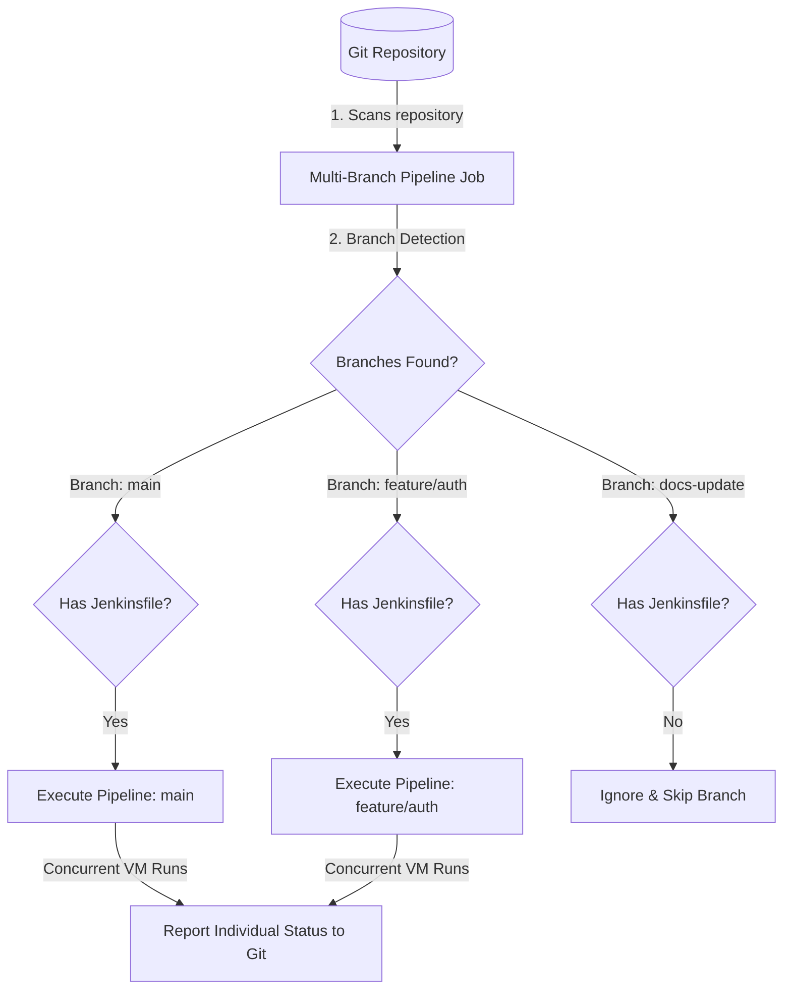

# Jenkins Study Notes: Day 2 (12 May 2026)
## Topic: Jenkins Pipelines (Freestyle vs. Pipeline, Declarative vs. Scripted, and Multi-Branch)

Today we explore the core of Pipeline-as-Code. We compare legacy Freestyle configurations against modern Groovy-based Pipelines, dissect Declarative and Scripted syntaxes, and investigate Multi-Branch scanning.

---

## 1. Detailed Theory Notes

### Freestyle Jobs vs. Jenkins Pipelines
* **Freestyle Jobs**: Configured entirely through the Jenkins Web UI form fields. Easy for simple tasks but difficult to version control, review, template, or recover if deleted.
* **Jenkins Pipelines**: Implements **Pipeline-as-Code** using a text file called a **`Jenkinsfile`** written in Groovy and stored directly in your git repository.
  * *Version Controlled*: Changes to the pipeline are committed, reviewed, and audited just like application source code.
  * *Resilient*: If the Jenkins master crashes mid-run, pipelines can automatically resume execution from their last state.
  * *Complex Orchestration*: Supports loop blocks, conditional stages, try-catch error handling, and manual approval gates.

### Declarative vs. Scripted Pipelines
Jenkins pipelines can be written in two distinct syntaxes:

| Feature | Declarative Pipeline | Scripted Pipeline |
| :--- | :--- | :--- |
| **Syntactic Model** | Strict, structured DSL (Domain Specific Language). | Raw, flexible Groovy script. |
| **Root Wrapper** | `pipeline { ... }` | `node { ... }` |
| **Learning Curve** | Low. Standardized structure makes it readable and easy for beginners. | High. Requires standard Groovy programming knowledge. |
| **Error Handling** | Handled declaratively via predefined `post` conditions. | Handled imperatively using standard Groovy `try-catch-finally` blocks. |
| **Flexibility** | Rigid layout. Can execute Groovy scripts only inside a `script { ... }` block. | Unrestricted. Any Groovy code can be written anywhere. |

### Parameters and Environment Variables
* **Parameters**: Allow users to pass runtime variables to the pipeline when triggered manually (`parameters { string(...), choice(...), booleanParam(...) }`).
* **Environment Variables**: Variables scoped globally or to specific stages (`environment { DB_NAME = 'staging' }`).
* **Credentials Binding**: Never hardcode keys! Use `withCredentials` or declarative `credentials('CREDENTIALS_ID')` to safely bind passwords and SSH keys to temporary environment variables.

### Jenkins Multi-Branch Pipelines
A Multi-Branch Pipeline automatically discovers, manages, and executes pipelines for multiple branches in a Git repository.
* Jenkins scans the repository.
* For every branch it finds containing a `Jenkinsfile`, Jenkins automatically creates a sub-project and triggers a build.
* When branches are deleted or merged, Jenkins automatically archives or removes the corresponding sub-project, preventing dashboard clutter.

---

## 2. Multi-Branch Scanning Architecture (Mermaid)

The workflow diagram below illustrates how Jenkins scans a repository, identifies active branches, detects the presence of a `Jenkinsfile`, and executes independent concurrent pipelines:



---

## 3. Parallel Groovy Pipeline Examples

### Example A: Production Declarative Pipeline
```groovy
// Jenkinsfile (Declarative Syntax)
pipeline {
    agent { label 'linux-node' } // Target a specific agent by label
    
    // Runtime parameters definition
    parameters {
        string(name: 'BUILD_VERSION', defaultValue: '1.0.0', description: 'Application Build Version')
        choice(name: 'ENVIRONMENT', choices: ['dev', 'staging', 'prod'], description: 'Target Environment')
        booleanParam(name: 'RUN_TESTS', defaultValue: true, description: 'Run test suite?')
    }
    
    // Global environment variables
    environment {
        APP_NAME = 'backend-api'
        DB_USER = 'api_admin'
        // Securely bind database password secret to environment
        DB_PASS = credentials('DB_STAGING_PASSWORD')
    }
    
    stages {
        stage('Initialize') {
            steps {
                echo "Starting build process for ${APP_NAME} version ${params.BUILD_VERSION}"
                echo "Target Environment: ${params.ENVIRONMENT}"
            }
        }
        
        stage('Test Suite') {
            // Conditional step execution
            when {
                expression { params.RUN_TESTS == true }
            }
            steps {
                echo "Running application test cases..."
                sh 'npm test || echo Mock test run'
            }
        }
        
        stage('Deploy Staging') {
            steps {
                echo "Deploying to Staging Environment database as user: ${DB_USER}"
                // The password value below is automatically masked as *** in console logs
                sh "echo Deploying using secret: ${DB_PASS}"
            }
        }
    }
    
    // Post actions based on execution state
    post {
        always {
            echo "Pipeline run completed."
        }
        success {
            echo "Deploy succeeded. Triggering notifications..."
        }
        failure {
            echo "Job failed! Please review console logs."
        }
    }
}
```

### Example B: Identical Scripted Pipeline Configuration
```groovy
// Jenkinsfile (Scripted Groovy Syntax)
node('linux-node') {
    // Scoping parameters and environment variables in Scripted mode
    def appName = 'backend-api'
    def dbUser = 'api_admin'
    
    try {
        stage('Initialize') {
            echo "Starting build process for scripted pipeline: ${appName}"
        }
        
        stage('Test Suite') {
            // Conditional step executed via standard Groovy logic
            if (params.RUN_TESTS) {
                echo "Running application test cases..."
                sh 'npm test || echo Mock test run'
            } else {
                echo "Skipping test stage."
            }
        }
        
        stage('Deploy Staging') {
            // Bind credentials using raw Groovy wrapper
            withCredentials([string(credentialsId: 'DB_STAGING_PASSWORD', variable: 'DB_PASS')]) {
                echo "Deploying to Staging database as user: ${dbUser}"
                sh "echo Deploying using secret: ${DB_PASS}"
            }
        }
        
        // Success execution path
        echo "Deploy succeeded. Triggering notifications..."
        
    } catch (Exception e) {
        // Failure execution path
        currentBuild.result = 'FAILURE'
        echo "Job failed! Exception: ${e.message}"
        throw e
    } finally {
        // Post execution path
        echo "Pipeline run completed."
    }
}
```

---

## 4. Practical Exercises

### Exercise 1: Convert Freestyle to Declarative Pipeline
1. Create a legacy Freestyle Job in Jenkins that checks out a repo, runs a shell command `echo "Compiling..."`, and archives a text file.
2. Re-implement the exact same steps inside a `Jenkinsfile` utilizing Declarative pipeline syntax.
3. Commit the `Jenkinsfile` to your Git repository, create a new **Pipeline** Job in Jenkins, point it to your Git repository, and run it.

### Exercise 2: Multi-Branch Pipeline Lab
1. Create a local git repository. Create branches: `main` and `feature/new-ui`.
2. Write a `Jenkinsfile` containing steps unique to the branch by referencing the default variable `env.BRANCH_NAME`.
3. Commit the `Jenkinsfile` to both branches.
4. Set up a **Multi-Branch Pipeline** in Jenkins, point it to your repository, and run a **Branch Indexing Scan**. Verify that both branches are discovered and build concurrently.

---

## 5. Viva Questions (University Exam prep)

**Q1: What is the purpose of the `agent` block in a Declarative Pipeline?**
* **Answer**: The `agent` block defines *where* the entire pipeline or specific stages will execute (e.g., targeting a specific agent by label, running inside a Docker container, or running on `any` available node).

**Q2: What is the difference between `always`, `success`, and `failure` inside the `post` block?**
* **Answer**:
  * `always`: Executes regardless of the pipeline run's outcome (success, failure, or aborted).
  * `success`: Executes only if the current run completes successfully.
  * `failure`: Executes only if the current run fails.

**Q3: How do you safely utilize user passwords or credentials inside a shell step in a pipeline without exposing them in logs?**
* **Answer**: Store credentials in Jenkins Credential Store, and bind them to variables in your pipeline using the `credentials('ID')` helper or `withCredentials()` block. Jenkins automatically intercepts the console output and masks these values with `***` in the build logs.

**Q4: What is the default pipeline wrapper keyword in Scripted Pipelines?**
* **Answer**: The wrapper keyword is **`node`** (e.g., `node('label') { ... }`), whereas Declarative pipelines use **`pipeline`** (e.g., `pipeline { ... }`).

---

## 6. Interview Questions (Placement prep)

**Q1: Discuss the advantages of Declarative pipelines over Scripted pipelines. When would an enterprise choose Scripted pipelines instead?**
* **Answer**:
  * **Declarative Advantages**: Provides a structured, readable syntax with strict rules. It has built-in error handling (`post` blocks), simplifies validation, and integrates cleanly with blue-ocean UI tools. It is the modern standard for 90% of pipelines.
  * **When to choose Scripted**: When a pipeline requires complex programmatic logic, custom Groovy classes, complex loop statements, dynamic stage generation, or conditional logic that is restricted or overly complex to express in Declarative DSL.

**Q2: How does a Multi-branch Pipeline work under the hood? How does it handle new branch creations and merges?**
* **Answer**: A Multi-branch pipeline queries the Git repository's API or scans the branches locally.
  * When a new branch is created with a `Jenkinsfile`, the scan detects it, creates a sub-job, and triggers a build.
  * When a PR is created, it builds the PR merge branch.
  * When a branch is merged and deleted, the subsequent scan marks the sub-job as disabled or deletes it, keeping the Jenkins dashboard clean.

**Q3: What is the difference between `env` and `params` contexts in a Jenkins pipeline? How do you access them?**
* **Answer**:
  * `env`: Accesses system and pipeline environment variables (e.g., `env.BUILD_NUMBER`, `env.BRANCH_NAME`). These can be read or modified.
  * `params`: Accesses read-only parameters passed to the build during manual execution (e.g., `params.RELEASE_VERSION`). They cannot be overwritten during the pipeline run.

---

## 7. Best Practices

* **Pipeline-as-Code**: Always define pipelines in a `Jenkinsfile` committed to Git. Avoid creating raw inline pipelines directly in the Jenkins UI.
* **Define Timeout Blocks**: Always wrap network-heavy steps in a `timeout` block (e.g., `timeout(time: 10, unit: 'MINUTES')`) to prevent hung processes from blocking your build executors indefinitely.
* **Use fail-fast on stages**: In parallel stages, set `failFast true` to immediately terminate all sibling parallel runs if one fails, saving resource minutes.

---

## 8. Common Mistakes

* **Tabs/Spaces Indentation in Groovy**: Using tabs inside steps or blocks can sometimes throw parser errors in older Jenkins installations.
* **Incorrect block scopes**: Trying to place raw Groovy scripts directly inside a Declarative stage without wrapping them inside a `script { ... }` block, resulting in compilation failures.
* **Parameters Missing on First Run**: Triggering a parameterized pipeline for the first time immediately after creation. Jenkins must run the pipeline once to parse the `Jenkinsfile` and register the parameters before the "Build with Parameters" button appears.

---

## 9. Summary Notes for Last-Minute Revision

* **Declarative wrapper**: `pipeline { ... }`.
* **Scripted wrapper**: `node { ... }`.
* **Needs Groovy**: Use `script { ... }` block to run Groovy code inside Declarative pipelines.
* **Multi-branch**: Scans Git branches and runs pipelines automatically for branches containing a `Jenkinsfile`.
* **Safe Secrets**: Access credentials via `credentials()` or `withCredentials()` blocks to ensure log masking.
