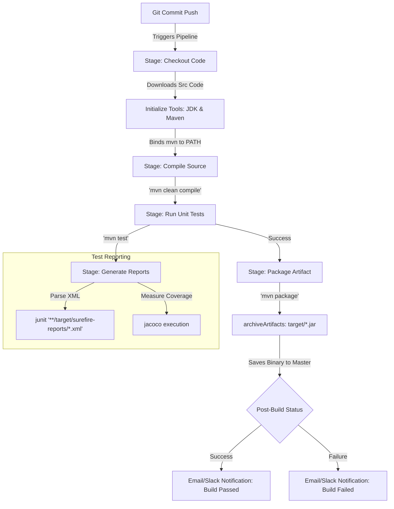

# Jenkins Study Notes: Day 3 (13 May 2026)
## Topic: Pipeline Stages, Maven Integration, and Artifact Management

In Day 3, we focus on standard Java CI compilation. We cover Global Tool Configurations for Maven, running unit tests, generating XML test reports, publishing HTML coverage graphs, archiving output binaries (JAR/WAR), and using Post execution states.

---

## 1. Detailed Theory Notes

### Pipeline Lifecycle Stages
A robust Continuous Integration (CI) pipeline generally follows four critical steps:
1. **Checkout**: Retrieves the specific git branch/commit revision.
2. **Compile / Build**: Resolves packages, links source files, and builds binaries.
3. **Test**: Runs the unit and integration test suites.
4. **Package**: Archives the successful build into a deployable package (e.g., `.jar`, `.war`).

### Jenkins and Maven Integration
Maven is the standard build automation tool for Java projects (`pom.xml`). To use Maven inside a Jenkins pipeline:
* **Global Tool Configuration**: Administrators define one or more Maven installations under **Manage Jenkins** -> **Tools** (e.g., naming an entry `'M3'` and checking "Install automatically").
* **Tools Directive**: Inside the Declarative Pipeline, the `tools` block binds this installation to the runner's path automatically.
  ```groovy
  tools {
      maven 'M3'
  }
  ```
* **Execution**: Steps can now execute standard Maven goals like `sh 'mvn clean package'`.

### Code Coverage & Test Reports
* **JUnit Reports**: When Maven executes unit tests via the Surefire plugin, it generates XML test reports under `target/surefire-reports/`. The `junit` step parses these XML files and renders test trends on the Jenkins dashboard.
  ```groovy
  junit '**/target/surefire-reports/*.xml'
  ```
* **Code Coverage (JaCoCo)**: The JaCoCo plugin measures what percentage of the codebase is covered by unit tests, rendering coverage reports directly in the Jenkins UI.

### Artifact Management
Once a build succeeds, the resulting binary (e.g. `target/app.war`) is a **Build Artifact**.
* **`archiveArtifacts`**: Instructs Jenkins to copy the binary from the transient agent workspace to the persistent Master host. This ensures the compiled artifact remains accessible and downloadable from the Jenkins UI even after the agent VM is destroyed.
  ```groovy
  archiveArtifacts artifacts: 'target/*.war', onlyIfSuccessful: true
  ```

---

## 2. Java CI Build Lifecycle (Mermaid)

The workflow diagram below represents the end-to-end continuous integration pipeline for a Java project managed by Maven in Jenkins:



---

## 3. Production-Grade Java Maven Jenkinsfile

Below is an enterprise-level Declarative Pipeline script configured for Java/Maven applications, incorporating global tools, test parsing, post-build notification hooks, and artifact archiving:

```groovy
pipeline {
    agent { label 'maven-agent' }

    // Global tools binding
    tools {
        maven 'M3'  // Matches the exact name defined in Jenkins Global Tool Configuration
        jdk 'JDK17' // Binds Java Development Kit 17
    }

    environment {
        POM_PATH = 'pom.xml'
        WAR_FILE = 'target/payment-gateway.war'
    }

    stages {
        stage('Checkout Code') {
            steps {
                // Checkout code from the triggering Git branch
                checkout scm
            }
        }

        stage('Compile Application') {
            steps {
                echo "==== COMPILING SOURCES ===="
                sh 'mvn -f ${POM_PATH} clean compile'
            }
        }

        stage('Execute Unit Tests') {
            steps {
                echo "==== RUNNING TEST SUITE ===="
                // Run tests and ensure builds do not crash immediately if tests fail (to allow report parsing)
                sh 'mvn -f ${POM_PATH} test'
            }
            // Parse unit test reports even if the build steps crashed
            post {
                always {
                    echo "Parsing JUnit XML test reports..."
                    junit '**/target/surefire-reports/*.xml'
                }
            }
        }

        stage('Package Application') {
            steps {
                echo "==== PACKAGING WAR BINARY ===="
                // Skip tests here as they were executed in the previous stage
                sh 'mvn -f ${POM_PATH} package -DskipTests'
            }
        }

        stage('Archive Artifacts') {
            steps {
                echo "==== ARCHIVING BINARIES TO MASTER ===="
                // Copy the successfully compiled WAR file to the Master node
                archiveArtifacts artifacts: "${WAR_FILE}", onlyIfSuccessful: true
            }
        }
    }

    // Handle post-execution status reporting
    post {
        always {
            cleanWs() // Deep clean workspace directories on the agent VM to save disk space
        }
        success {
            echo "SUCCESS: Build and compilation passed. WAR archived."
        }
        failure {
            echo "FAILURE: Build crashed! Triggering Slack/Email alert..."
        }
    }
}
```

---

## 4. Practical Exercises

### Exercise 1: Configure Auto-Installing Maven
1. Open your local Jenkins Dashboard.
2. Go to **Manage Jenkins** -> **Tools** (Global Tool Configuration).
3. Scroll down to the **Maven** section -> Click **Add Maven**.
4. Set Name to `M3`. Check the box **"Install automatically"** -> Select version `3.9.6` from Apache.
5. Setup a JDK installation named `JDK17` configured for automatic download.
6. Write a simple pipeline targeting `tools { maven 'M3' }` and run `sh 'mvn --version'` to verify that Jenkins downloads and configures Maven on the agent automatically during runtime.

### Exercise 2: Test Report Integration
1. Create a dummy Java Maven project containing a JUnit test case.
2. Setup a pipeline running the unit tests using `mvn test` followed by the `junit '**/target/surefire-reports/*.xml'` step.
3. Push a commit that causes the unit test to fail.
4. Verify that the Jenkins build status is marked as **UNSTABLE** (Yellow) instead of FAILED (Red), and check the test trends displayed on the job's homepage.

---

## 5. Viva Questions (University Exam prep)

**Q1: What is the difference between an UNSTABLE (Yellow) build and a FAILED (Red) build in Jenkins?**
* **Answer**:
  * **UNSTABLE (Yellow)**: The code compiled successfully, but a post-build step reported a failure (usually failing **unit tests** parsed by the `junit` plugin).
  * **FAILED (Red)**: The pipeline execution crashed due to a compiler error, script syntax error, missing dependency, or a command exiting with a non-zero code.

**Q2: What is the purpose of the `archiveArtifacts` step? Where are the files stored?**
* **Answer**: It copies build output files (like `.jar`, `.war`, or `.zip` files) from the transient executor agent's filesystem to the persistent **Jenkins Master host filesystem** (`$JENKINS_HOME/jobs/<job-name>/builds/<build-number>/archive/`), making them downloadable from the Jenkins Web UI.

**Q3: How do you declare global build tools like Maven or Gradle inside a Declarative Pipeline?**
* **Answer**: By using the `tools` directive block at the pipeline level and referencing the exact tool name defined in Jenkins' Global Tool Configuration (e.g. `tools { maven 'mvn-3.9' }`).

**Q4: What is the purpose of the `cleanWs()` step?**
* **Answer**: It wipes the current workspace directory clean on the agent VM after a build finishes. This is a best practice to free up disk space and prevent leftover files from contaminating subsequent builds.

---

## 6. Interview Questions (Placement prep)

**Q1: How does Jenkins manage multi-version tool dependencies (e.g. project A needs Maven 3.6 + JDK 11, while project B needs Maven 3.9 + JDK 17)?**
* **Answer**: This is managed using **Jenkins Global Tool Configuration** and the pipeline-level `tools` directive:
  1. Define multiple Maven and JDK installations in the global tools settings with unique names (e.g., `M3.6`, `M3.9`, `JDK11`, `JDK17`).
  2. In Project A's `Jenkinsfile`, specify:
     ```groovy
     tools { maven 'M3.6'; jdk 'JDK11' }
     ```
  3. In Project B's `Jenkinsfile`, specify:
     ```groovy
     tools { maven 'M3.9'; jdk 'JDK17' }
     ```
  Jenkins automatically configures the environment paths on the agent dynamically for each run, preventing version conflicts.

**Q2: A developer notices that unit test failures do not mark the build as unstable, and instead the build succeeds. What is the likely cause?**
* **Answer**:
  1. The `junit` post-build parser step is completely missing from the `Jenkinsfile`.
  2. The path pattern passed to the junit step (e.g. `'**/target/surefire-reports/*.xml'`) is incorrect or does not match the actual test output path.
  3. The Maven execution command is overriding test failures (e.g., running `mvn package -Dmaven.test.failure.ignore=true`), which prevents the build process from flagging the failures.

**Q3: Why is using Jenkins' Built-in artifact archiver discouraged for storing large production releases in enterprise setups? What is the alternative?**
* **Answer**: Archiving large artifacts on the Jenkins Master host consumes significant disk space, which can eventually fill up the master’s storage, slowing down or crashing the controller.
  * *Alternative*: Use specialized **Binary Repository Managers** like **JFrog Artifactory**, **Sonatype Nexus**, or cloud object stores (like AWS S3). The pipeline publishes the compiled binaries directly to these external repositories using their APIs or CLI plugins, leaving Jenkins to handle orchestration only.

---

## 7. Best Practices

* **Always use `cleanWs()`**: Include `cleanWs()` in the post-build block to clear the agent's disk space and ensure a clean slate for the next build.
* **Archive Only Successful Builds**: Ensure `archiveArtifacts` is only executed when the build succeeds to avoid archiving incomplete or broken binaries.
* **Keep Pom Configurations Clean**: Let Maven handle its dependencies internally; avoid adding custom curl scripts in Jenkins to fetch third-party Java libraries.

---

## 8. Common Mistakes

* **Incorrect Tool Identifier**: Writing `maven 'maven'` when the actual tool is named `M3` in the Jenkins Dashboard, causing immediate build initialization failures.
* **Hardcoded Paths**: Using absolute workspace paths (e.g. `/var/jenkins_home/workspace/job/target/app.jar`) instead of relative paths (e.g. `target/app.jar`) inside the archiving step, which causes builds to break if moved to a different agent.
* **Skipping Test Parse on Failure**: Placing the `junit` step inside a standard stage *after* a failing test command. If the test step exits with a non-zero code, Jenkins stops the stage immediately and skips subsequent steps, failing to parse the test reports. Always place the `junit` step in the `post { always { ... } }` block.

---

## 9. Summary Notes for Last-Minute Revision

* **Tools Block**: Binds auto-installed runtimes (`maven`, `jdk`, `gradle`).
* **JUnit parser**: `junit '**/target/surefire-reports/*.xml'` renders test trends on the dashboard.
* **archiveArtifacts**: Copies transient agent binaries to the master server for persistence.
* **Unstable Status (Yellow)**: Compilation succeeded, but unit tests failed.
