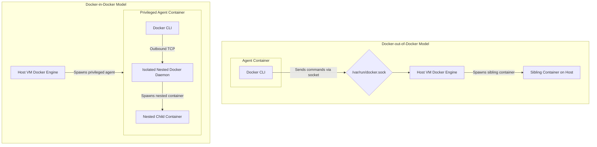

# Jenkins Study Notes: Day 4 (14 May 2026)
## Topic: Docker Integration, GitHub Webhooks, and Backup & Restore

On Day 4, we explore containerized CI pipelines. We compare DooD vs. DinD container models, run pipeline steps inside dynamic Docker agents, publish images to Docker Hub/GHCR, establish GitHub Webhook automated triggers, and define Jenkins Backup & Restore protocols.

---

## 1. Detailed Theory Notes

### Docker inside Jenkins Agents (DooD vs. DinD)
When running containerized pipelines inside a Jenkins Agent that is itself running as a Docker container, you must configure how the agent communicates with the Docker engine. There are two primary architectural models:

1. **Docker-out-of-Docker (DooD - Host Bind Mount)**:
   * **Mechanism**: The Jenkins agent container mounts the host's Docker socket file (`-v /var/run/docker.sock:/var/run/docker.sock`).
   * **Advantages**: Lightweight and fast. The agent does not run a nested Docker daemon; instead, it sends commands back to the host's Docker engine. Containers spawned by the agent run side-by-side with the agent on the host, sharing the host's local cache.
   * **Security Risk**: High. The agent container gains full administrative control over the host's Docker daemon, allowing it to compromise the host.

2. **Docker-in-Docker (DinD - Isolated Nested Daemon)**:
   * **Mechanism**: The agent runs a completely isolated, nested instance of the Docker daemon inside its own container boundaries. Requires running the agent container in `--privileged` mode.
   * **Advantages**: Clean isolation. The agent container operates in its own sandboxed environment, completely independent of the host VM's Docker engine.
   * **Cons**: Slower execution times (cannot share the host's image caches) and complex networking setups.

### Docker Pipeline Plugin Syntax
The **Docker Pipeline Plugin** allows you to use container images as execution environments directly in your pipeline.
* **Stage-level Container Agent**: Run specific stages in dedicated runtime containers (e.g. running Python tests inside a Python container, and Node tests inside a Node container):
  ```groovy
  agent {
      docker {
          image 'node:20-alpine'
          args '-v /tmp:/tmp'
      }
  }
  ```

### Jenkins and GitHub Integration (Webhooks)
To trigger Jenkins pipelines automatically when code is pushed to GitHub, we use **GitHub Webhooks**:
1. Configure a webhook in GitHub repository settings pointing to Jenkins: `http://<jenkins-url>/github-webhook/`.
2. Set the payload content type to `application/json`.
3. In Jenkins, enable the trigger **"GitHub hook trigger for GITScm polling"** inside the job configuration.
4. When a developer pushes a commit, GitHub sends a POST request containing the commit payload. Jenkins receives it, identifies the matching project, and triggers a build.

### Backup and Restore of Jenkins Master
A backup strategy is critical to recover from infrastructure failures.
* **What to Backup**:
  * `$JENKINS_HOME/*.xml` (Global and job-level configuration metadata).
  * `$JENKINS_HOME/plugins/` (Installed plugins).
  * `$JENKINS_HOME/secrets/` (Encryption keys).
  * `$JENKINS_HOME/users/` (User databases).
* **What to Exclude**:
  * `$JENKINS_HOME/workspace/` (Transient build work directories; easily re-cloned from Git).
  * `$JENKINS_HOME/builds/` (Build history and logs; can be excluded to save space in major disaster recovery backups).
* **Automated Backups**: Can be scheduled using the **ThinBackup** plugin or cron scripts that package these directories into compressed tar archives.

---

## 2. DooD vs. DinD Architecture Comparison (Mermaid)

The diagram below compares the communication paths of Docker-out-of-Docker (sharing the host socket) against Docker-in-Docker (isolated nested daemons):



---

## 3. Production-Grade Containerized Jenkinsfile

The pipeline script below runs compilation steps inside a dynamic Node.js container agent, builds a production Docker image, authenticates with GitHub Container Registry (GHCR), and publishes the image securely:

```groovy
pipeline {
    agent {
        // Run the entire pipeline on an agent that has the Docker CLI installed
        label 'docker-runner'
    }

    environment {
        REGISTRY = 'ghcr.io'
        IMAGE_NAME = 'danishanwar/payment-service'
        IMAGE_TAG = "v${env.BUILD_NUMBER}"
        // Securely retrieve credentials from Jenkins store
        REGISTRY_CREDS = credentials('GHCR_PUBLISH_SECRET')
    }

    stages {
        stage('Checkout Code') {
            steps {
                checkout scm
            }
        }

        stage('Compile inside Container') {
            agent {
                // Execute this stage's steps inside a Node.js container
                docker {
                    image 'node:20-alpine'
                    reuseNode true // Run on the same agent VM without provisioning a new node
                }
            }
            steps {
                echo "==== RUNNING COMPILATION INSIDE NODE CONTAINER ===="
                sh 'npm install'
                sh 'npm run build || echo "Mock compile finished"'
            }
        }

        stage('Build Docker Image') {
            steps {
                echo "==== COMPILED PRODUCTION IMAGE ===="
                // Build the production Docker image using the Docker CLI on the agent host
                sh "docker build -t ${REGISTRY}/${IMAGE_NAME}:${IMAGE_TAG} ."
                sh "docker tag ${REGISTRY}/${IMAGE_NAME}:${IMAGE_TAG} ${REGISTRY}/${IMAGE_NAME}:latest"
            }
        }

        stage('Publish Image to GHCR') {
            steps {
                echo "==== AUTHENTICATING AND PUSHING TO GHCR ===="
                // Login and push using the bound credentials
                sh "echo ${REGISTRY_CREDS} | docker login ${REGISTRY} -u danishanwar --password-stdin"
                sh "docker push ${REGISTRY}/${IMAGE_NAME}:${IMAGE_TAG}"
                sh "docker push ${REGISTRY}/${IMAGE_NAME}:latest"
            }
        }
    }

    post {
        always {
            echo "==== CLEANING UP LOCAL IMAGES ===="
            // Remove local images to free up disk space on the agent VM
            sh "docker rmi -f ${REGISTRY}/${IMAGE_NAME}:${IMAGE_TAG} || true"
            sh "docker rmi -f ${REGISTRY}/${IMAGE_NAME}:latest || true"
            cleanWs()
        }
    }
}
```

---

## 4. Practical Exercises

### Exercise 1: Build Steps in a Dynamic Docker Agent
1. Create a Jenkins pipeline job.
2. Write a `Jenkinsfile` where the root-level `agent` is set to `none`.
3. Define two stages:
   * **Stage 1 (Node Build)**: Set the stage-level agent to `docker { image 'node:20-alpine' }`. Run `node --version`.
   * **Stage 2 (Python Test)**: Set the stage-level agent to `docker { image 'python:3.11-alpine' }`. Run `python --version`.
4. Run the pipeline and verify that Jenkins spins up the respective containers dynamically, executes the steps inside them, and shuts them down upon stage completion.

### Exercise 2: Simulated Manual Controller Backup Script
1. Log in to your Jenkins server's terminal shell.
2. Locate the `$JENKINS_HOME` directory (usually `/var/jenkins_home` or `/var/lib/jenkins`).
3. Write a bash script `backup.sh` that uses `tar` to package all configuration XMLs, secrets, and plugins, while excluding workspaces and build logs:
   ```bash
   tar --exclude='workspace' --exclude='builds' -czf /tmp/jenkins_backup.tar.gz -C $JENKINS_HOME .
   ```
4. Schedule the backup script to run automatically using Jenkins cron triggers or a local crontab entry.

---

## 5. Viva Questions (University Exam prep)

**Q1: What is the main security hazard of mounting `/var/run/docker.sock` inside a Jenkins agent container?**
* **Answer**: It gives the unprivileged agent container full root access to the host machine's Docker daemon. A user can run docker commands to mount the host's root directory (`-v /:/host`) and read or modify sensitive files on the host VM, effectively bypassing all container security boundaries.

**Q2: What files must be included in a backup of `$JENKINS_HOME` to guarantee recovery from a total system crash?**
* **Answer**: You must backup all global and job configuration XML files (`*.xml`), the `plugins/` directory, `secrets/` keys (essential to decrypt credentials), and the `users/` folder.

**Q3: How do you configure a GitHub webhook to trigger a Jenkins job on every code push?**
* **Answer**: In your GitHub repository settings, add a webhook with the URL `http://<jenkins-ip>:8080/github-webhook/`, set Content-Type to `application/json`, and select the "Just the push event" trigger. In your Jenkins job, check the option **"GitHub hook trigger for GITScm polling"**.

**Q4: What is the benefit of using `reuseNode true` in a stage-level Docker agent?**
* **Answer**: It instructs Jenkins to run the stage's container on the **same agent node** already allocated to the pipeline, instead of provisioning a brand-new workspace node. This saves execution time by avoiding redundant workspace checkouts.

---

## 6. Interview Questions (Placement prep)

**Q1: Contrast Docker-out-of-Docker (DooD) with Docker-in-Docker (DinD) in containerized CI/CD systems. When is each preferred?**
* **Answer**:
  * **DooD (Preferred for Speed)**: Mounts the host's Docker socket `/var/run/docker.sock` inside the agent. The agent uses the host's Docker engine.
    * *Pros*: Faster builds because it shares the host's image and layer caches directly.
    * *Cons*: Security risk; the agent can compromise the host host.
  * **DinD (Preferred for Security/Isolation)**: Runs an isolated nested Docker daemon inside a privileged agent container.
    * *Pros*: Total isolation. Security is higher because the host engine is protected.
    * *Cons*: Slower (cannot share host image caches easily) and requires running the agent container in `--privileged` mode.

**Q2: How do you handle Docker Hub API rate limits (e.g., 100 pulls per 6 hours for anonymous users) in large-scale Jenkins build environments?**
* **Answer**:
  1. **Authenticate**: Log in to Docker Hub using a paid service account inside your pipeline before pulling images.
  2. **Internal Proxy / Registry Mirror**: Set up a local private registry mirror (like Sonatype Nexus, Artifactory, or Harbor) inside your VPC to cache frequently used base images.
  3. **Use Local Registries**: Configure Jenkins agents to pull base images from cloud registries (like AWS ECR or GitHub Container Registry) instead of public Docker Hub repositories.

**Q3: Explain how you would automate the recovery of a crashed Jenkins instance from a backup archive.**
* **Answer**:
  1. Provision a clean VM and install the same version of Jenkins.
  2. Stop the Jenkins service (`sudo systemctl stop jenkins`).
  3. Extract the backup archive directly into the `$JENKINS_HOME` directory (overwriting default configurations).
  4. Ensure correct file ownership and permissions: `sudo chown -R jenkins:jenkins $JENKINS_HOME`.
  5. Restart the Jenkins service (`sudo systemctl start jenkins`) and verify that all jobs, configurations, and plugins are restored successfully.

---

## 7. Best Practices

* **Isolate Agent Workspace Images**: Use minimal alpine-based images for dynamic Docker stages to reduce network download times.
* **Keep Secrets Out of Console Logs**: Always bind credentials using `withCredentials` and never print passwords using plain `echo` statements.
* **Use DinD with Caution**: Only use privileged Docker-in-Docker setups when absolute isolation between builds is required.

---

## 8. Common Mistakes

* **Missing trailing slash in webhook URL**: Entering `http://<jenkins-url>/github-webhook` without the trailing slash `/` in GitHub settings. This can cause redirection errors and prevent Jenkins from receiving webhook triggers.
* **Excluding Secrets from Backups**: Backing up XML configurations while omitting the `$JENKINS_HOME/secrets/` directory. Without the secrets keys, Jenkins cannot decrypt stored passwords, database credentials, or SSH private keys after a restore, rendering the configurations useless.
* **Docker command not found**: Trying to run `sh 'docker build ...'` inside a dynamic Docker container stage (e.g., `node:alpine`) that does not have the Docker CLI installed.

---

## 9. Summary Notes for Last-Minute Revision

* **DooD**: Share host engine socket via `/var/run/docker.sock` mount.
* **DinD**: Runs a nested Docker daemon. Requires running the agent container in `--privileged` mode.
* **Dynamic Agents**: Run stages in isolated runtime containers via `agent { docker { image '...' } }`.
* **Webhook path**: `http://<jenkins-url>/github-webhook/` (trailing slash is mandatory).
* **Core Backup Items**: `config.xml`, `plugins/`, `secrets/`, and `users/`.
