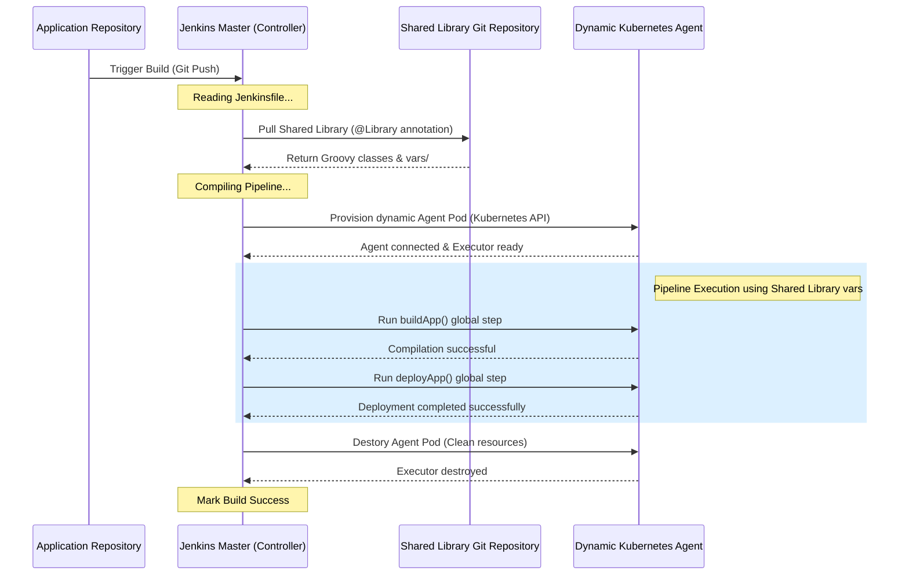

# Jenkins Study Notes: Day 5 (15 May 2026)
## Topic: Global Shared Libraries, Dynamic Agents, and Staging Deployments

On Day 5, we cover advanced Jenkins orchestration: Global Shared Libraries for reusing pipeline code across repositories, dynamic containerized agents (Kubernetes pod scaling), and secure multi-environment deployments.

---

## 1. Detailed Theory Notes

### Global Shared Libraries
In large organizations with hundreds of microservices, copying and pasting the same `Jenkinsfile` structure across all repositories is highly discouraged. It leads to configuration drift, hard-to-maintain pipelines, and security risks.
* **The Solution**: **Global Shared Libraries**. Reusable Groovy helper functions and pipeline steps are defined in a central repository, allowing other pipelines to import them.
* **Directory Structure of a Shared Library Repository**:
  ```text
  my-shared-library/
  ├── src/                # Standard Groovy helper classes (OOP classes)
  │   └── com/company/Helper.groovy
  ├── vars/               # Custom global steps/variables (callable directly from Jenkinsfile)
  │   ├── buildApp.groovy
  │   └── deployApp.groovy
  └── resources/          # Static non-Groovy helper files (JSON config, SQL schemas, XML templates)
  ```
* **How to Import inside a `Jenkinsfile`**:
  Use the `@Library` annotation at the very top of your file. The underscore `_` import statement imports all global steps defined under `vars/`:
  ```groovy
  @Library('my-shared-library@main') _
  ```

### Dynamic Container-Based Agents
Instead of maintaining static, long-lived VMs (which sit idle most of the time, consuming resources), modern enterprise Jenkins installations use **dynamic, containerized agent topologies**:
1. Jenkins integrates with a container orchestrator like **Kubernetes** or **Docker Swarm**.
2. When a build is triggered, Jenkins uses the **Kubernetes Plugin** to request a new pod.
3. The orchestrator spins up a temporary container containing the required build tools (e.g., Maven, JDK).
4. The container connects as a Jenkins agent, executes the pipeline stages, and is terminated immediately upon build completion.
5. *Benefit*: Zero-maintenance agent VMs, infinite scaling, and absolute resource isolation.

### SSH/SFTP Agents
For static deployments, Jenkins can connect to remote target VMs over SSH or SFTP:
* **SSH Build Agents**: Permanent machines connected using the **SSH Build Agents plugin**.
* **Direct SSH Commands inside pipelines**: Using tools like `sshagent` or direct shell execution to copy compiled binaries (`scp`) and run scripts (`ssh`) on remote servers.

---

## 2. Shared Library Pipeline Execution Flow (Mermaid)

The diagram below illustrates how Jenkins loads a central shared library repository, parses global variables, and executes a standardized build pipeline:



---

## 3. Production Groovy Examples

### Example A: Central Shared Library Step (`vars/buildApp.groovy`)
Save the following helper function inside your shared library repository under `vars/buildApp.groovy`:
```groovy
// vars/buildApp.groovy
def call(Map config = [:]) {
    def buildTool = config.get('tool', 'maven')
    
    echo "==== SHARED LIBRARY: COMPILING APPLICATION ===="
    echo "Application Name: ${config.name}"
    
    if (buildTool == 'maven') {
        sh 'mvn clean package -DskipTests'
    } else if (buildTool == 'npm') {
        sh 'npm run build'
    } else {
        error "Unsupported build tool specified: ${buildTool}"
    }
}
```

### Example B: Application `Jenkinsfile` Importing the Shared Library
This is the simple `Jenkinsfile` placed in the application's repository. It imports the shared library and calls the custom global step `buildApp`:

```groovy
// Import the shared library configured globally in Jenkins
@Library('enterprise-shared-library@v1.2.0') _

pipeline {
    agent { label 'docker-runner' }

    environment {
        APP_NAME = 'billing-service'
        DEPLOY_TARGET = 'staging'
    }

    stages {
        stage('Checkout Code') {
            steps {
                checkout scm
            }
        }

        stage('Compile Application') {
            steps {
                // Call the custom step from the Shared Library, passing configuration parameters
                buildApp(
                    name: "${APP_NAME}",
                    tool: 'maven'
                )
            }
        }

        stage('Secure Remote SSH Deployment') {
            steps {
                echo "==== CONNECTING TO STAGING TARGET VM ===="
                // Securely load the deployment SSH credentials from the Jenkins store
                sshagent(['staging-vm-ssh-key']) {
                    // Transfer the compiled JAR and restart the service on the remote VM
                    sh '''
                        ssh -o StrictHostKeyChecking=no ubuntu@10.0.4.15 "
                            echo 'Connected successfully!'
                            docker stop billing-app || true
                            docker rm billing-app || true
                            docker run -d -p 8081:80 --name billing-app nginx:alpine
                        "
                    '''
                }
            }
        }
    }

    post {
        always {
            cleanWs()
        }
    }
}
```

---

## 4. Practical Exercises

### Exercise 1: Create a Basic Shared Library
1. Create a local Git repository named `my-jenkins-library`.
2. Add a directory named `vars/`.
3. Create a file `vars/sayHello.groovy` containing:
   ```groovy
   def call(String name) {
       echo "Hello, ${name}! This output is generated by a central Shared Library."
   }
   ```
4. Commit and push this repository to GitHub.
5. In Jenkins: Go to **Manage Jenkins** -> **System** (Configure System) -> Scroll down to **Global Pipeline Libraries** -> Add your library with the name `my-library`, pointing it to your Git repository URL.
6. Write a `Jenkinsfile` in your project repository that imports the library and calls your custom step:
   ```groovy
   @Library('my-library@main') _
   stage('Test') { steps { sayHello('Danish') } }
   ```
7. Run the build and verify the output.

### Exercise 2: Dynamic Agent Script Simulation
1. Install the **Kubernetes** plugin in Jenkins.
2. Configure a pipeline with a dynamic agent pod definition directly inside the `Jenkinsfile`:
   ```groovy
   agent {
       kubernetes {
           yaml '''
             apiVersion: v1
             kind: Pod
             spec:
               containers:
               - name: maven
                 image: maven:3.9.6-eclipse-temurin-17
                 command: ["cat"]
                 tty: true
           '''
       }
   }
   ```
3. Run the pipeline, and inspect your Kubernetes cluster to see the pod spin up, execute the compilation, and shut down automatically.

---

## 5. Viva Questions (University Exam prep)

**Q1: Explain the purpose of the three directories `src/`, `vars/`, and `resources/` in a Jenkins Shared Library.**
* **Answer**:
  * `src/`: Contains standard Groovy class definitions (OOP code) to implement complex utilities.
  * `vars/`: Contains global variable files whose filenames define custom pipeline steps callable directly in a `Jenkinsfile` (e.g. `vars/buildApp.groovy` enables the `buildApp()` step).
  * `resources/`: Contains helper files (JSON config, SQL files, script templates) that can be read inside pipeline steps.

**Q2: What is the significance of the underscore `_` import statement when importing a Shared Library?**
* **Answer**: The underscore `_` imports **all global steps** defined under the `vars/` directory of the shared library, making them directly callable inside your pipeline stages without requiring class instantiation.

**Q3: Contrast static build agents with dynamic container-based build agents.**
* **Answer**:
  * **Static Agents**: Long-running dedicated VMs. They consume CPU/RAM continuously even when idle, require manual operating system updates, and can lead to workspace contamination across runs.
  * **Dynamic Agents**: Short-lived containers spun up on-demand (e.g. on a Kubernetes cluster) when a build is scheduled. They are completely isolated, require zero VM maintenance, and are destroyed immediately after build completion to release system resources.

**Q4: What is the purpose of the `sshagent` block in a pipeline?**
* **Answer**: It securely loads SSH private keys from Jenkins' credential store and configures an SSH key agent in the background for the duration of the block, allowing SSH/SCP commands to authenticate with remote staging or production servers without exposing the key material in scripts.

---

## 6. Interview Questions (Placement prep)

**Q1: How do you design and scale an enterprise CI/CD system running 500 parallel builds concurrently without crashing your Jenkins Controller?**
* **Answer**:
  1. **Disable built-in node execution**: Set Master executors to `0` to dedicate it strictly to orchestration.
  2. **Dynamic Kubernetes Agents**: Use the Kubernetes plugin to offload all build executions to a Kubernetes cluster, spinning up temporary agent pods on-demand.
  3. **Shared Pipeline Libraries**: Standardize build steps across all repositories using a central Shared Library to minimize memory consumption on the Master.
  4. **Allocate adequate system resources**: Scale the Jenkins Master's JVM heap memory (`-Xmx`) and allocate sufficient system resources to prevent OutOfMemory (OOM) errors from concurrent builds.

**Q2: How do you manage changes, version control, and testing for a Jenkins Shared Library without breaking active production pipelines?**
* **Answer**:
  1. Maintain a separate staging Jenkins server to test library modifications.
  2. Work on development branches in the shared library repository (e.g., `feature/upgrade-build`).
  3. In test pipelines, import the development branch explicitly: `@Library('my-library@feature/upgrade-build') _`.
  4. Once validated, merge changes to the default branch (`main`) and tag the commit with a semantic version (e.g., `v2.0.0`).
  5. Instruct production pipelines to pin the library import to the specific immutable version tag: `@Library('my-library@v2.0.0') _` to prevent breaking changes from affecting production builds.

**Q3: If a SSH agent's keys expire mid-deployment, how do you configure fallback authentication in a pipeline?**
* **Answer**: Hardcoding passwords as fallbacks is a major security risk.
  * *Correct approach*: Use credentials binding to load a backup deployment user token, or configure an automated credential rotation system (such as Vault or AWS Secrets Manager) to fetch valid credentials dynamically before executing the deployment commands.

---

## 7. Best Practices

* **Always Version Pin Shared Libraries**: Always import shared libraries with an explicit tag (e.g. `@Library('library@v1.2.0')`) to prevent unexpected upstream updates from breaking your active builds.
* **Keep Shared Library Logic Simple**: Avoid adding overly complex business logic to shared libraries; they should focus strictly on reusable helper steps.
* **Release Agent Resources**: Always clean dynamic workspaces and close remote connections to release agent resources immediately upon job completion.

---

## 8. Common Mistakes

* **Missing trailing underscore**: Writing `@Library('my-shared-library')` without the trailing space and underscore `_`, resulting in syntax errors.
* **Non-serializable variables in classes**: Using non-serializable variables inside classes in your shared library. Jenkins pipelines pause and resume builds by serializing their state; using non-serializable objects will cause pipeline crashes with a `NotSerializableException`.
* **State Pollution on Persistent Nodes**: Modifying persistent system-level configurations on long-lived SSH agents, which can lead to unpredictable build failures on subsequent runs.

---

## 9. Summary Notes for Last-Minute Revision

* **Shared Library layout**: `src/` (standard Groovy classes), `vars/` (reusable pipeline steps), `resources/` (static helpers).
* **Import Statement**: `@Library('lib-name@tag') _` (underscore is mandatory).
* **Dynamic Agents**: Containers spun up dynamically (e.g., via Kubernetes) to execute builds and terminated immediately upon completion.
* **sshagent**: Safely manages SSH private keys from the credentials store to connect to remote VMs without exposing key material.
