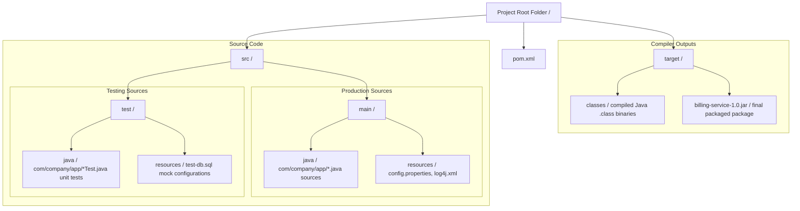

# Maven Build Automation Study Notes: Day 1 (27 April 2026)
## Topic: Build Automation Foundations, Project Object Model (POM), and Standard Directory Layout

Welcome to Day 1 of the Maven Build Automation Study Program. Today, we lay down the core concepts of automated software packaging, dissect the structural architecture of the `pom.xml` configuration, and examine Maven's standardized directory convention.

---

## 1. Detailed Theory Notes

### Why Do Build Tools Exist?
Before automated build tools (like Maven, Gradle, or Ant) existed, developers had to compile, test, package, and deploy Java applications manually using command-line scripts (like `javac`, `java`, `jar`).
Manual builds presented several critical bottlenecks:
1. **Classpath Hell**: Developers had to manually download all third-party libraries (`.jar` files) and add them to the system classpath. If library A depended on library B, developers had to find and download library B manually as well, leading to dependency tracking nightmares.
2. **Environment Drift ("Works on My Machine")**: Scripts configured on a developer's local machine frequently crashed on other machines or CI servers due to differences in local path names, OS architectures, or installed Java versions.
3. **Inconsistent Lifecycles**: Different teams used entirely different custom scripts to compile and package projects. There was no standardized workflow to compile, test, or package code across an organization.
4. **Integration Complexity**: Lacked a clean, unified way to plug in third-party automation tools like unit test runners, static code analysis suites, or container compilers.

### Problems Solved by Automated Builds
* **Declarative Dependency Management**: You declare the libraries your project needs inside a configuration file; the build tool automatically downloads them from a central repository, along with their transitive dependencies.
* **Standardized Lifecycles**: Provides a uniform sequence of execution phases (e.g. compile, test, package) recognized across all projects.
* **Portability**: Standardizes path configurations and compilers, ensuring that the same build command runs identically on a local developer VM, an on-premise testing agent, or a cloud CI runner.
* **Seamless Automation**: Easily integrates into CI/CD pipelines (such as Jenkins or GitHub Actions).

### The Project Object Model (POM) and Coordinates
In Maven, a project is defined declaratively by an XML file named **`pom.xml`** (Project Object Model) placed in the root of the repository.
* **Maven Coordinates (GAV)**: Every project or dependency in Maven must declare three unique coordinates that act as its address in the central library registry:
  * **`groupId`**: Identifies the organization or company namespace (e.g. `com.company.project`). Generally follows reverse domain name rules.
  * **`artifactId`**: The name of the specific project module/binary (e.g. `billing-service`).
  * **`version`**: The version number of the project. Can use snapshot indicators for active development (e.g. `1.0.0-SNAPSHOT` or release tags `2.4.1`).
* **Packaging**: Specifies what target file format the build compiler should produce (e.g., `jar` for library binaries, `war` for web archives, `pom` for parent parent configurations).

### Standard Directory Structure of a Maven Project
Maven enforces a strict **Convention over Configuration** design pattern. Rather than requiring developers to manually define source and output paths inside XML files, Maven expects files to reside in specific directories.

---

## 2. Directory Structure Diagram (Mermaid)

The directory map below visualizes the standardized Maven tree layout, showing the structural separation between production Java source files, unit test suites, configuration resources, and compiler outputs:



---

## 3. Standard Production-Grade base `pom.xml`

Below is an annotated, production-grade foundational `pom.xml` file demonstrating the declarative coordinate architecture and dependency registration:

```xml
<?xml version="1.0" encoding="UTF-8"?>
<!-- Root wrapper declaring the Maven POM namespace schema -->
<project xmlns="http://maven.apache.org/POM/4.0.0"
         xmlns:xsi="http://www.w3.org/2001/XMLSchema-instance"
         xsi:schemaLocation="http://maven.apache.org/POM/4.0.0 http://maven.apache.org/xsd/maven-4.0.0.xsd">
    <modelVersion>4.0.0</modelVersion>

    <!-- Core GAV Coordinates defining the project's unique identity -->
    <groupId>com.company.finance</groupId>
    <artifactId>billing-service</artifactId>
    <version>1.0.0-SNAPSHOT</version>
    
    <!-- Specifies that the output target format should be a standard Java Archive (JAR) -->
    <packaging>jar</packaging>

    <name>Company Billing Service</name>
    <description>Core automated invoice generation and billing system module.</description>

    <!-- Defines global properties like compiler source and target versions -->
    <properties>
        <maven.compiler.source>17</maven.compiler.source>
        <maven.compiler.target>17</maven.compiler.target>
        <project.build.sourceEncoding>UTF-8</project.build.sourceEncoding>
        <junit.version>5.10.1</junit.version>
    </properties>

    <!-- Lists all third-party dependencies to download and add to classpath -->
    <dependencies>
        <!-- Dependency 1: Log4j Logger Library -->
        <dependency>
            <groupId>org.apache.logging.log4j</groupId>
            <artifactId>log4j-core</artifactId>
            <version>2.20.0</version>
        </dependency>

        <!-- Dependency 2: JUnit 5 Jupiter API (Scoped exclusively to Test classpath) -->
        <dependency>
            <groupId>org.junit.jupiter</groupId>
            <artifactId>junit-jupiter-api</artifactId>
            <version>${junit.version}</version>
            <scope>test</scope>
        </dependency>
    </dependencies>
</project>
```

---

## 4. Practical Exercises

### Exercise 1: Establish a Maven Project Manually
1. Open your local CLI terminal. Create a clean project folder: `mkdir -p maven-lab1 && cd maven-lab1`.
2. Re-create the standard Maven directory layout manually using CLI shell commands:
   ```bash
   mkdir -p src/main/java/com/company/app
   mkdir -p src/main/resources
   mkdir -p src/test/java/com/company/app
   mkdir -p src/test/resources
   ```
3. Create a `pom.xml` file in the root folder and write the basic coordinates configuration shown in Section 3.
4. Add a basic Java class `App.java` inside `src/main/java/com/company/app/` containing a main method that prints "Hello from Maven!".
5. Run the compiler using a local Maven installation (`mvn compile`) and inspect the compiled output generated under the newly created `target/` directory.

### Exercise 2: Maven Command Line Coordinate Extraction
1. Write a shell command to print the GAV coordinates of your project dynamically using the Maven help plugin:
   ```bash
   mvn help:evaluate -Dexpression=project.groupId -q -DforceStdout
   ```
2. Verify that the command outputs the exact `groupId` declared in your `pom.xml`.

---

## 5. Viva Questions (University Exam prep)

**Q1: Explain the concept of "Convention over Configuration" as implemented by Maven.**
* **Answer**: Maven enforces standard conventions (pre-defined rules) for project configurations, such as the standard directory tree structure (production code in `src/main/java`, test code in `src/test/java`, build outputs in `target/`). By adhering to these standard paths, developers do not need to write complex configurations to specify where files reside; Maven automatically locate and compiles them out-of-the-box.

**Q2: What are the three core coordinates that uniquely identify any Maven artifact?**
* **Answer**: The coordinates are known as **GAV**:
  1. **`groupId`**: Identifies the organization or project namespace (e.g. `com.google`).
  2. **`artifactId`**: The unique name of the specific project module/binary (e.g. `guava`).
  3. **`version`**: The version number of the artifact (e.g. `32.0.0-jre`).

**Q3: What is the purpose of the `target/` directory in a Maven project? Can it be committed to version control systems like Git?**
* **Answer**: The `target/` directory is the default location where Maven writes all build output files, including compiled `.class` files, generated resource assets, and final packaged archives (e.g. `.jar` or `.war` files). It should **never** be committed to version control systems; it must be added to the `.gitignore` file since its contents are transient and easily re-generated during build runs.

**Q4: What does the `-SNAPSHOT` suffix in a Maven version coordinate represent?**
* **Answer**: The `-SNAPSHOT` suffix indicates that the artifact is an **active development version** and not a stable production release. It instructs Maven to bypass standard caching and check the remote repository for updated builds of the same version on every build run.

---

## 6. Interview Questions (Placement prep)

**Q1: How does Maven resolve dependencies? Detail the path an artifact takes from declaration to local cache.**
* **Answer**:
  1. When a dependency is declared in `pom.xml`, Maven first searches the **Local Repository** (located on the developer's machine at `~/.m2/repository/`).
  2. If found locally, Maven binds it to the project classpath immediately.
  3. If it is missing locally, Maven connects to configured **Remote Repositories** (like corporate mirrors or the public **Maven Central Repository** at `https://repo.maven.apache.org/maven2/`).
  4. Maven downloads the dependency `.jar` and its POM metadata over HTTP, saves them in the local `~/.m2/repository/` cache for future runs, and links it to the build.

**Q2: Contrast Maven with Apache Ant. What key architectural shifts did Maven introduce?**
* **Answer**:
  * **Apache Ant** is a procedural build tool. You must write explicit step-by-step XML scripts to define how to compile, where to copy, and how to zip files. It has no built-in dependency management system or directory standards.
  * **Apache Maven** introduced a **declarative model** with standardized lifecycles and convention-over-configuration. Developers only define *what* the project is and *what* it needs (via dependencies in `pom.xml`), and Maven handles the steps automatically, eliminating custom build scripts.

**Q3: What is Classpath Hell, and how does Maven's dependency resolution mechanism solve it?**
* **Answer**: Classpath Hell occurs when a project relies on multiple external libraries that depend on conflicting versions of other shared libraries, or when developers manually load incompatible JAR files into the classpath, resulting in runtime errors like `ClassNotFoundException` or `NoClassDefFoundError`.
  * *Solution*: Maven manages this declaratively. You define dependencies in `pom.xml`, and Maven's dependency engine automatically resolves and organizes all dependent libraries recursively. It uses strict conflict-resolution rules (like the nearest-wins rule) to keep only a single, compatible version of each library on the classpath.

---

## 7. Best Practices

* **Always Adhere to Directory Standards**: Never customize default source directories inside `pom.xml` unless absolutely necessary; adhering to standard layouts keeps builds portable.
* **Exclude Target Directory**: Always add the `target/` directory to your project's `.gitignore` file to avoid committing compiled binaries.
* **Keep Coordinates Clean**: Keep `groupId` names aligned with reverse corporate domain structures to prevent name collisions in centralized registries.

---

## 8. Common Mistakes

* **Tabs in POM.xml XML Markup**: Leaving syntax markup unclosed or adding control characters can prevent parser engines from executing XML validations.
* **Manual `.jar` Downloads**: Manually placing third-party `.jar` files in a local resource directory and adding them to the compiler classpath using custom system paths instead of declaring them as standard Maven dependencies.
* **Snapshot version in production releases**: Leaving `-SNAPSHOT` version suffixes on artifacts when deploying to staging or production, which can lead to unpredictable runtime updates.

---

## 9. Summary Notes for Last-Minute Revision

* **GAV**: `groupId` (namespace), `artifactId` (module name), `version` (version number).
* **Convention Over Configuration**: Production code goes in `src/main/java`, test code goes in `src/test/java`.
* **Local cache folder**: `~/.m2/repository/`.
* **target/**: The build output folder (exclude from Git).
