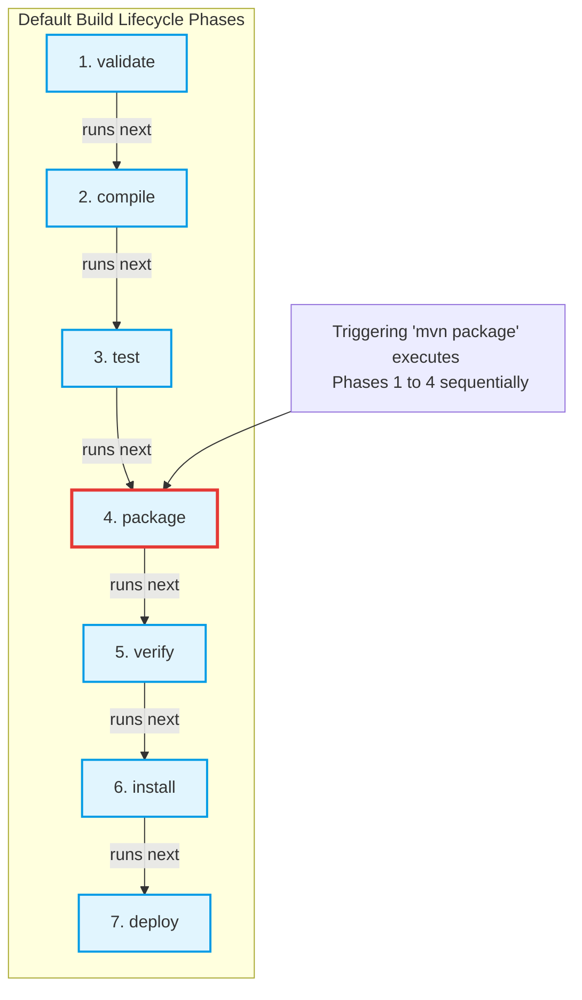

# Maven Build Automation Study Notes: Day 2 (28 April 2026)
## Topic: Build Lifecycles, Core Phases, and Parent POM Inheritance

On Day 2, we explore the Maven execution model: Build Lifecycles and Phases. We detail the sequential execution of the Default lifecycle, examine Parent POM inheritance, and learn how to manage multi-module enterprise hierarchies.

---

## 1. Detailed Theory Notes

### Built-in Maven Lifecycles
Maven provides three built-in build lifecycles. Each lifecycle is responsible for a different aspect of project automation:
1. **Default (Build) Lifecycle**: Handles the complete compilation, testing, packaging, and distribution of the application.
2. **Clean Lifecycle**: Handles clearing compiler outputs and temporary build files from previous runs to ensure a clean slate.
3. **Site Lifecycle**: Handles generating technical documentation pages and reports based on project metadata.

### Default Lifecycle Phases
A lifecycle is made up of sequential **phases**. When you execute a specific phase in a lifecycle, Maven automatically executes **every preceding phase** in that lifecycle's sequence before running the target phase.

The core phases of the **Default Lifecycle** run in this exact order:

| Phase | Responsibility | Execution Output |
| :--- | :--- | :--- |
| **`validate`** | Verifies the project structure and validates that all necessary configurations and dependencies are available. | Basic schema verification logs. |
| **`compile`** | Compiles the production source code files (`.java` files under `src/main/java`) into JVM bytecode. | Compiled `.class` files generated in `target/classes/`. |
| **`test`** | Runs the project's unit tests using a testing framework (e.g. JUnit or TestNG). | Test logs and XML test results generated in `target/surefire-reports/`. |
| **`package`** | Takes the compiled bytecode class files and packages them into their final distribution format (defined by `<packaging>` in the POM, e.g. `.jar` or `.war`). | Package compiled inside `target/`. |
| **`verify`** | Runs any integration tests and performs quality checks on the packaged binary to ensure it meets requirements. | Integration test reports. |
| **`install`** | Installs (copies) the packaged binary into your local Maven repository cache (`~/.m2/repository/`) so other local projects can use it as a dependency. | Copied package in local cache directory. |
| **`deploy`** | Copies the final packaged binary to a remote, shared binary repository (like JFrog Artifactory or Sonatype Nexus) for distribution across teams. | Package published to remote server repository. |

* **Sequential Execution Example**: Running `mvn package` will automatically execute `validate`, `compile`, and `test` in sequence before packaging your code. Running `mvn clean install` runs the entire clean lifecycle first, followed by the default lifecycle up to the `install` phase.

### Clean and Site Lifecycles
* **Clean Phases**:
  * `pre-clean`: Prepares for cleaning.
  * `clean`: Removes the `target/` directory, wiping all compiled classes, packaged binaries, and reports.
  * `post-clean`: Performs cleanup steps after the clean phase.
* **Site Phases**:
  * `pre-site`: Prepares for site generation.
  * `site`: Generates the HTML documentation pages based on the project's POM configuration.
  * `post-site`: Performs final site steps.
  * `site-deploy`: Deploys the generated site documentation to a web server.

### Parent POM (Inheritance)
In enterprise applications with multiple microservices or modules, configuring compiler versions, corporate mirrors, and library versions in every project leads to configuration duplication and drift.
* **The Solution**: **Parent POM**.
* A parent POM is a central `pom.xml` (with `<packaging>pom</packaging>`) that defines global configurations, properties, and plugin settings.
* Sub-modules import this parent POM using the `<parent>` tag. They automatically inherit all properties, dependencies, and plugin settings declared in the parent, keeping sub-module POMs minimal and clean.

---

## 2. Default Build Phase Sequence (Mermaid)

The diagram below illustrates the sequential order of default build lifecycle phases, highlighting how executing a downstream phase automatically triggers all upstream phases:



---

## 3. Parent-Child Inheritance POM XML Configuration

### Parent POM (`pom.xml` inside parent directory)
```xml
<?xml version="1.0" encoding="UTF-8"?>
<project xmlns="http://maven.apache.org/POM/4.0.0"
         xmlns:xsi="http://www.w3.org/2001/XMLSchema-instance"
         xsi:schemaLocation="http://maven.apache.org/POM/4.0.0 http://maven.apache.org/xsd/maven-4.0.0.xsd">
    <modelVersion>4.0.0</modelVersion>

    <groupId>com.company.enterprise</groupId>
    <artifactId>parent-bom</artifactId>
    <version>1.0.0</version>
    <!-- Essential coordinate defining this as an orchestrating parent POM -->
    <packaging>pom</packaging>

    <properties>
        <maven.compiler.source>17</maven.compiler.source>
        <maven.compiler.target>17</maven.compiler.target>
        <log4j.version>2.20.0</log4j.version>
    </properties>

    <!-- Global dependencies inherited automatically by all sub-modules -->
    <dependencies>
        <dependency>
            <groupId>org.apache.logging.log4j</groupId>
            <artifactId>log4j-core</artifactId>
            <version>${log4j.version}</version>
        </dependency>
    </dependencies>
</project>
```

### Child Module POM (`pom.xml` inside child module directory)
```xml
<?xml version="1.0" encoding="UTF-8"?>
<project xmlns="http://maven.apache.org/POM/4.0.0"
         xmlns:xsi="http://www.w3.org/2001/XMLSchema-instance"
         xsi:schemaLocation="http://maven.apache.org/POM/4.0.0 http://maven.apache.org/xsd/maven-4.0.0.xsd">
    <modelVersion>4.0.0</modelVersion>

    <!-- Imports parent configurations. Inherits groupID, version, and dependencies -->
    <parent>
        <groupId>com.company.enterprise</groupId>
        <artifactId>parent-bom</artifactId>
        <version>1.0.0</version>
        <!-- Relative path to the parent directory pom.xml -->
        <relativePath>../pom.xml</relativePath>
    </parent>

    <artifactId>child-service</artifactId>
    
    <!-- Child inherits G and V coordinates from the parent; packaging defaults to jar -->
    <dependencies>
        <!-- No need to declare log4j-core here; it is inherited from parent-bom -->
    </dependencies>
</project>
```

---

## 4. Practical Exercises

### Exercise 1: Lifecycle Execution Sequence Lab
1. Navigate to your manual project directory from Day 1.
2. Run `mvn clean`. Verify in your filesystem that the `target/` directory is deleted.
3. Run `mvn compile`. Open your filesystem and check `target/classes/` to verify that compiled Java `.class` files have been generated.
4. Run `mvn install`. Open your local home cache directory (`~/.m2/repository/com/company/app/...`) and verify that your compiled project `.jar` is saved there.
5. Review the execution logs to confirm that all preceding phases ran in order.

### Exercise 2: Parent POM Configuration Propagation
1. Create a parent folder named `multi-module-demo/`.
2. Inside it, create a `pom.xml` with `<packaging>pom</packaging>` and define a property value: `<my-shared-property>Hello-Enterprise</my-shared-property>`.
3. Create a child directory `module-a/` inside the parent directory.
4. Create a `pom.xml` inside `module-a/` referencing the parent POM.
5. Execute the evaluation command inside `module-a/`:
   ```bash
   mvn help:evaluate -Dexpression=my-shared-property -q -DforceStdout
   ```
6. Verify that the child successfully inherits the property value defined in the parent POM.

---

## 5. Viva Questions (University Exam prep)

**Q1: What are the three standard lifecycles built into Apache Maven?**
* **Answer**: The built-in lifecycles are:
  1. **`default`**: Manages application compilation, testing, packaging, and deployments.
  2. **`clean`**: Manages deleting build outputs and clearing temporary compile states.
  3. **`site`**: Manages generating HTML documentation based on project metadata.

**Q2: What is the main difference between the `package`, `install`, and `deploy` build phases?**
* **Answer**:
  * `package` compiles source files and packages the bytecode into its distribution format (e.g. `.jar` or `.war`) inside the local `target/` folder.
  * `install` copies that packaged binary into the local developer machine's repository cache (`~/.m2/repository/`) so other local projects can reference it.
  * `deploy` pushes the final packaged binary to a remote, shared repository server (like Artifactory or Nexus) for distribution to other teams.

**Q3: If you execute the command `mvn install`, will Maven run unit tests?**
* **Answer**: Yes. In the Default lifecycle, `test` is an upstream phase that precedes `install`. Therefore, executing `mvn install` automatically runs the `validate`, `compile`, and `test` phases first before installing the artifact.

**Q4: What element must be declared in a Parent POM's coordinates block instead of JAR or WAR?**
* **Answer**: The Parent POM must declare **`<packaging>pom</packaging>`** to signify that it acts as an orchestrator and inherited configuration template rather than a compilable binary codebase.

---

## 6. Interview Questions (Placement prep)

**Q1: How does Maven handle multi-module project aggregation? What is the difference between project Inheritance (Parent POM) and Project Aggregation (Multi-Module)?**
* **Answer**:
  * **Inheritance (Parent POM)**: Relies on the `<parent>` tag. It allows a child project to inherit configurations, properties, dependencies, and plugins from the parent POM. It is about **reusing configuration**.
  * **Aggregation (Multi-Module)**: Relies on the `<modules>` tag defined in a parent POM. It aggregates multiple independent projects so they can be compiled, tested, and packaged together with a single command from the parent root directory. It is about **orchestrating builds**.
  * Projects frequently combine both concepts, serving as both parents (for inheritance) and aggregators (declaring `<modules>`).

**Q2: If an integration test suite fails, which Maven lifecycle phase catches this failure? How do you isolate integration testing from unit testing?**
* **Answer**:
  * Integration test failures are verified during the **`verify`** phase.
  * *Isolation Strategy*:
    * Unit tests are managed by the **Maven Surefire Plugin** and executed during the **`test`** phase. They test classes in isolation.
    * Integration tests are managed by the **Maven Failsafe Plugin** and executed during the **`verify`** phase. The Failsafe plugin is designed to allow the build to proceed past failures so cleanup steps can run, reporting integration test failures at the end of the `verify` phase.

**Q3: How do you configure Maven to bypass unit test execution when compiling packages for staging? Is this a recommended practice?**
* **Answer**:
  * You can bypass test execution by passing the flag `-DskipTests` (compiles test classes but does not execute them) or `-Dmaven.test.skip=true` (bypasses both compilation and execution of test classes).
  * *Recommendation*: Bypassing tests is **not recommended** in production CI/CD pipelines since it risks deploying unvalidated code, though it can be useful to speed up local packaging during development.

---

## 7. Best Practices

* **Always Inherit properties**: Centralize version definitions (like `<spring.version>`) in the parent POM's properties block to ensure all child modules use identical, compatible library versions.
* **Keep Child POMs Minimal**: Avoid re-declaring dependencies in child POMs if they are already defined globally in the parent POM.
* **Clean Before Install**: Always run the clean lifecycle before install (`mvn clean install`) to prevent stale compiler classes from corrupting the newly generated package.

---

## 8. Common Mistakes

* **Incorrect `<relativePath>`**: Omitting or misconfiguring the `<relativePath>` tag in child POMs, preventing Maven from locating the parent POM on the local filesystem if it is not already installed in the local `.m2` repository.
* **Overwriting versions in Child POMs**: Manually specifying versions on dependencies in child POMs that are already managed by the parent, which bypasses the centralized dependency management and can lead to version conflicts.
* **Running `mvn deploy` without server configs**: Executing `mvn deploy` without configuring the target repository distribution parameters (`<distributionManagement>`) in `pom.xml`, resulting in immediate upload failures.

---

## 9. Summary Notes for Last-Minute Revision

* **Default phases order**: validate -> compile -> test -> package -> verify -> install -> deploy.
* **clean**: Wipes the `target/` directory.
* **Parent POM packaging**: Must be `pom`.
* **Inheritance vs Aggregation**: Parent POM shares configurations (`<parent>`); Aggregation orchestrates grouped builds (`<modules>`).
