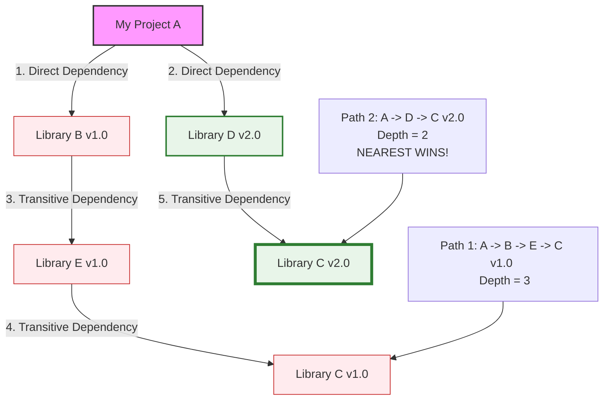

# Maven Build Automation Study Notes: Day 3 (29 April 2026)
## Topic: Dependency Management, Scopes, and Version Conflict Resolution

Today, we dive into the core feature of Maven: the Dependency Resolution Engine. We analyze dependency scopes, map transitive dependencies, dissect version conflict algorithms (nearest-wins), and master centralized version management using `<dependencyManagement>`.

---

## 1. Detailed Theory Notes

### Dependency Scopes
Not all dependencies are needed at all times. For example, testing frameworks (like JUnit) are essential for test compilation and execution but should never be bundled into the production package.
Maven implements six **dependency scopes** to control this classification:

1. **`compile` (Default Scope)**:
   * The library is required in all classpaths: compilation, testing, and execution.
   * It is packaged and bundled directly into the final artifact (e.g. inside the WAR's `WEB-INF/lib/` or the Shade JAR).
2. **`provided`**:
   * The library is required for compilation and testing but is **not** packaged into the final artifact because it is expected to be provided by the web container or server runtime (e.g. `servlet-api` or `tomcat-embed` provided by Tomcat).
3. **`runtime`**:
   * The library is **not** required for compilation but is required during test execution and runtime (e.g. JDBC database drivers like `mysql-connector-java` or `postgresql`).
4. **`test`**:
   * The library is required exclusively for test compilation and execution (e.g. `junit-jupiter`, `mockito-core`). It is completely omitted from production packages.
5. **`import`**:
   * Used exclusively within a `<dependencyManagement>` block of a POM with `<packaging>pom</packaging>`. It imports dependency version definitions from a Bill of Materials (BOM) POM, helping align version numbers across multiple independent projects.
6. **`system`** (Deprecated):
   * Similar to `provided` but requires you to provide an absolute path to a local JAR file on your system using the `<systemPath>` tag, making the build non-portable. Avoid using.

### Transitive Dependencies
If your project A declares a dependency on Library B, and Library B internally declares a dependency on Library C, Maven automatically resolves and downloads Library C, adding it to your classpath. This is known as a **transitive dependency**.
While convenient, it can lead to version conflicts if multiple dependencies require different versions of the same transitive library.

### Version Conflicts & Resolution (Nearest-Wins Rule)
When conflicts occur (e.g., two different libraries require different versions of the same transitive dependency), Maven resolves the conflict using two strict rules:

1. **Rule 1: Nearest Wins (Depth of Path)**:
   Maven selects the version that is closest to the project root in the dependency tree.
2. **Rule 2: First Declared (TIE-Breaker)**:
   If two versions of the same dependency are at the exact same depth in the dependency tree, Maven selects the version declared first in the `pom.xml` dependencies block.

### centralized Version Control: `<dependencyManagement>` vs `<dependencies>`
* **`<dependencies>`**: Directly downloads the declared libraries and binds them to the project classpath immediately.
* **`<dependencyManagement>`**: Declares the allowed version coordinates, scopes, and exclusions for dependencies, but **does not actually add them to the classpath or download them**.
  * It acts as a centralized coordinate registry.
  * In sub-modules, developers simply declare the dependency inside their `<dependencies>` block **without specifying the version tag**. The child automatically inherits the exact version defined in the parent's `<dependencyManagement>` block.

### Excluding Transitive Dependencies (`<exclusions>`)
If a dependency imports an unwanted transitive library (e.g., importing a legacy logger or a vulnerable jar), you can exclude it using the `<exclusions>` tag.

---

## 2. Transitive Dependency Trees & Nearest-Wins Resolution (Mermaid)

The tree diagram below visualizes how Maven evaluates dependency depth to resolve version conflicts, highlighting why `Library C v2.0` wins over `Library C v1.0`:



---

## 3. Production-Grade XML POM Configurations

### Parent POM: Centralized Dependency Registry (`pom.xml`)
```xml
<?xml version="1.0" encoding="UTF-8"?>
<project xmlns="http://maven.apache.org/POM/4.0.0"
         xmlns:xsi="http://www.w3.org/2001/XMLSchema-instance"
         xsi:schemaLocation="http://maven.apache.org/POM/4.0.0 http://maven.apache.org/xsd/maven-4.0.0.xsd">
    <modelVersion>4.0.0</modelVersion>

    <groupId>com.company.enterprise</groupId>
    <artifactId>parent-bom</artifactId>
    <version>1.0.0</version>
    <packaging>pom</packaging>

    <properties>
        <spring.version>6.1.2</spring.version>
        <jackson.version>2.16.1</jackson.version>
    </properties>

    <!-- Defines allowed version coordinates but does NOT download them yet -->
    <dependencyManagement>
        <dependencies>
            <!-- Spring Core Framework -->
            <dependency>
                <groupId>org.springframework</groupId>
                <artifactId>spring-core</artifactId>
                <version>${spring.version}</version>
            </dependency>

            <!-- Jackson JSON Parser -->
            <dependency>
                <groupId>com.fasterxml.jackson.core</groupId>
                <artifactId>jackson-databind</artifactId>
                <version>${jackson.version}</version>
            </dependency>
        </dependencies>
    </dependencyManagement>
</project>
```

### Child Module POM: Importing Managed Dependencies (`pom.xml`)
```xml
<?xml version="1.0" encoding="UTF-8"?>
<project xmlns="http://maven.apache.org/POM/4.0.0"
         xmlns:xsi="http://www.w3.org/2001/XMLSchema-instance"
         xsi:schemaLocation="http://maven.apache.org/POM/4.0.0 http://maven.apache.org/xsd/maven-4.0.0.xsd">
    <modelVersion>4.0.0</modelVersion>

    <parent>
        <groupId>com.company.enterprise</groupId>
        <artifactId>parent-bom</artifactId>
        <version>1.0.0</version>
        <relativePath>../pom.xml</relativePath>
    </parent>

    <artifactId>auth-service</artifactId>

    <!-- Downloads dependencies and adds them to classpath -->
    <dependencies>
        <!-- Child inherits version 6.1.2 automatically from parent-bom -->
        <dependency>
            <groupId>org.springframework</groupId>
            <artifactId>spring-core</artifactId>
        </dependency>

        <!-- Child inherits version 2.16.1, and excludes an unwanted transitive dependency -->
        <dependency>
            <groupId>com.fasterxml.jackson.core</groupId>
            <artifactId>jackson-databind</artifactId>
            <exclusions>
                <exclusion>
                    <groupId>com.fasterxml.jackson.core</groupId>
                    <artifactId>jackson-annotations</artifactId>
                </exclusion>
            </exclusions>
        </dependency>
    </dependencies>
</project>
```

---

## 4. Practical Exercises

### Exercise 1: Dependency Tree Analysis Lab
1. Open the terminal and navigate to your active Java project directory.
2. Add multiple direct dependencies to your `pom.xml` (e.g. spring-core, log4j).
3. Execute the dependency tree generator command:
   ```bash
   mvn dependency:tree
   ```
4. Inspect the output log and analyze the hierarchy to identify transitive libraries and their resolved version paths.

### Exercise 2: Excluding Transitive Libraries
1. Declare a direct dependency on a library that imports transitive logging frameworks (like `activemq-client` which transitive imports `slf4j`).
2. Run `mvn dependency:tree` and note the slf4j version path.
3. Configure the `<exclusions>` tag in your `pom.xml` to exclude `slf4j-api`.
4. Run `mvn dependency:tree` again and verify that the excluded library is removed from your project's dependency tree.

---

## 5. Viva Questions (University Exam prep)

**Q1: What is the default dependency scope in Maven if no scope is declared?**
* **Answer**: The default scope is **`compile`**.

**Q2: Explain the differences between the `compile` and `provided` dependency scopes.**
* **Answer**:
  * `compile`: The library is required at all stages (compilation, testing, execution) and is packaged directly into the final artifact (e.g. `.jar` or `.war`).
  * `provided`: The library is required for compilation and testing but is **not** packaged into the final artifact because it is expected to be provided by the runtime environment (e.g. the servlet container).

**Q3: Describe the "Nearest Wins" rule in Maven dependency version conflicts.**
* **Answer**: When different versions of the same dependency are imported transitively, Maven selects the version that is closest to the project root in the dependency tree (i.e. has the shortest depth path).

**Q4: What is the purpose of the `<exclusions>` tag?**
* **Answer**: The `<exclusions>` tag is used inside a dependency declaration to prevent Maven from downloading and importing a specific transitive dependency that is otherwise resolved automatically.

---

## 6. Interview Questions (Placement prep)

**Q1: What is the difference between `<dependencies>` and `<dependencyManagement>` blocks in a Parent POM? How do they help maintain large repositories?**
* **Answer**:
  * **`<dependencies>`**: Any dependency declared here is **automatically inherited and downloaded by all sub-modules**, adding them to their classpaths. This is used for global dependencies like loggers or utility libraries required by every module.
  * **`<dependencyManagement>`**: Declares allowed dependency coordinates (version, scope, exclusions) but **does not download them or add them to any classpath**. Sub-modules must explicitly declare the dependency in their local `<dependencies>` block to use it, but they **omit the version tag** to automatically inherit the version managed by the parent. This prevents version fragmentation across services.

**Q2: What is a Bill of Materials (BOM) in Maven? How is the `import` scope used to manage spring/cloud dependencies?**
* **Answer**: A **Bill of Materials (BOM)** is a POM file that defines a curated, tested, and compatible set of dependency versions inside its `<dependencyManagement>` block.
  * To use it, you declare the BOM in your project's `<dependencyManagement>` using the **`import`** scope:
    ```xml
    <dependency>
        <groupId>org.springframework.cloud</groupId>
        <artifactId>spring-cloud-dependencies</artifactId>
        <version>2023.0.0</version>
        <type>pom</type>
        <scope>import</scope>
    </dependency>
    ```
  This allows you to use any Spring Cloud dependency without specifying version tags, ensuring that all imported modules are mutually compatible out-of-the-box.

**Q3: How do you identify, debug, and resolve duplicate or conflicting class definitions on the classpath?**
* **Answer**:
  1. **Identify**: Duplicate classes often throw errors like `NoSuchMethodError` or `LinkageError` at runtime.
  2. **Debug**: Run the Maven command `mvn dependency:tree -Dverbose` (verbose is supported in older Maven versions, or use `mvn dependency:analyze` to scan for unused declared or used undeclared dependencies).
  3. **Resolve**:
     * Add explicit version definitions inside `<dependencyManagement>` to force Maven to use a specific version.
     * Configure `<exclusions>` on the direct dependency that is importing the duplicate transitive version.

---

## 7. Best Practices

* **Always Centralize Versions**: Use `<dependencyManagement>` in your parent POM to standardize library versions across all modules and prevent version drift.
* **Minimize Direct Dependencies**: Avoid declaring dependencies that you do not use directly in your code; let Maven handle transitive dependencies automatically.
* **Keep Exclusions Explicit**: Document why you are excluding transitive dependencies (e.g. security vulnerability, version conflict) using XML comments.

---

## 8. Common Mistakes

* **Hardcoded Child Versions**: Specifying version coordinates in child POMs for dependencies that are already managed by the parent POM, which bypasses the centralized dependency management.
* **Unintentional `compile` Scope**: Leaving testing frameworks (like JUnit or Mockito) with the default `compile` scope, causing them to be bundled into production archives and increasing the package footprint.
* **Circular Dependencies**: Defining circular dependencies (e.g. Module A depends on Module B, and Module B depends on Module A). Maven will throw a build cycle error and fail to compile.

---

## 9. Summary Notes for Last-Minute Revision

* **compile**: Needed everywhere, packaged.
* **provided**: Needed for compile/test, not packaged.
* **test**: Needed only for testing, not packaged.
* **Nearest Wins Rule**: Shortest path to the root wins.
* **TIE-Breaker Rule**: First declared wins.
* **dependencyManagement**: Registers versions without downloading them.
