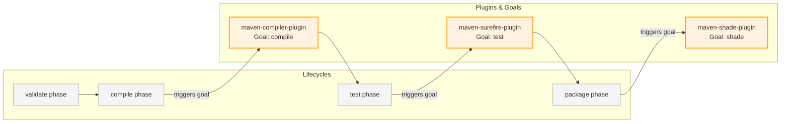

# Maven Build Automation Study Notes: Day 4 (30 April 2026)
## Topic: Maven Plugins, Custom Executions, and the Maven Wrapper (mvnw)

On Day 4, we examine the execution layer: Plugins. We configure the Compiler and Surefire plugins, build an executable Uber-JAR using the Shade plugin, bind plugin goals to lifecycle phases, and implement the Maven Wrapper (`mvnw`) for portable builds.

---

## 1. Detailed Theory Notes

### Extensibility via Plugins and Goals
Maven's core engine is extremely lightweight and does not know how to compile code or run tests on its own. Instead, it delegates all tasks to **Plugins**.
* **Plugin**: A packaged collection of one or more **Goals**.
* **Goal**: A specific, atomic task that can be executed (e.g., `compiler:compile` is the compile goal of the compiler plugin; `surefire:test` runs unit tests).
* **Phase Binding**: Maven binds specific plugin goals to lifecycle phases by default (e.g. `compiler:compile` is bound to the `compile` phase; `surefire:test` is bound to the `test` phase). When you execute a phase, Maven runs all plugin goals bound to it.

### Core Maven Plugins
1. **`maven-compiler-plugin`**:
   * Configures the JDK version and compiler flags used to compile your Java source files.
   * *Essential configurations*: `<source>` and `<target>` JDK versions (e.g. `17` or `21`).
2. **`maven-surefire-plugin`**:
   * The default plugin used to run unit tests and parse their outcomes.
   * Generates detailed XML and text reports under `target/surefire-reports/`.
3. **`maven-shade-plugin`**:
   * Used to create an **Uber-JAR** (also known as a **Fat-JAR**).
   * **Uber-JAR**: A single, self-contained executable JAR file containing the compiled project classes *and* the extracted class files of all transitive dependencies.
   * **Why use it?** It simplifies deployment; you can run the entire application on any server with a single command:
     `java -jar app.jar`
     This eliminates the need to manage classpaths or install external dependencies on the target host.

### Custom Goal Phase Bindings
You can bind external plugin goals to execute during specific lifecycle phases using the `<executions>` block. For example, you can configure the Shade plugin to run its `shade` goal automatically during the `package` phase.

### The Maven Wrapper (`mvnw`)
When building a project on a remote CI server, a team member's computer, or a clean container, you cannot guarantee that Maven is pre-installed or that the correct Maven version is configured.
* **The Solution**: **Maven Wrapper (`mvnw`)**.
* The wrapper is a set of scripts (`mvnw` for Linux/macOS, `mvnw.cmd` for Windows) and a configuration folder (`.mvn/`) placed in the root of your repository.
* When you run `./mvnw clean install`, the script automatically checks if the correct version of Maven is installed. If not, it downloads the declared Maven version, caches it locally, and runs the command using that downloaded version.
* **Benefit**: Guarantees build consistency and version alignment across all developer machines and CI/CD pipelines.

---

## 2. Plugin Goal-to-Phase Binding Map (Mermaid)

The diagram below visualizes how Maven coordinates build phases and executes specific plugin goals sequentially during a build run:



---

## 3. Production-Grade Plugin Configuration XML

Below is an advanced `pom.xml` snippet showing how to configure the Compiler, Surefire, and Shade plugins, binding the Shade goal to the `package` phase to create an executable Uber-JAR:

```xml
<build>
    <!-- Configures and manages plugins used in the build lifecycle -->
    <plugins>
        <!-- Plugin 1: Maven Compiler Plugin -->
        <plugin>
            <groupId>org.apache.maven.plugins</groupId>
            <artifactId>maven-compiler-plugin</artifactId>
            <version>3.11.0</version>
            <configuration>
                <source>17</source>
                <target>17</target>
                <encoding>UTF-8</encoding>
                <!-- Enables detailed compiler warnings -->
                <compilerArgs>
                    <arg>-Xlint:unchecked</arg>
                    <arg>-Xlint:deprecation</arg>
                </compilerArgs>
            </configuration>
        </plugin>

        <!-- Plugin 2: Maven Surefire Plugin (Runs tests) -->
        <plugin>
            <groupId>org.apache.maven.plugins</groupId>
            <artifactId>maven-surefire-plugin</artifactId>
            <version>3.1.2</version>
            <configuration>
                <!-- Include specific test naming patterns -->
                <includes>
                    <include>**/*Test.java</include>
                    <include>**/*Spec.java</include>
                </includes>
            </configuration>
        </plugin>

        <!-- Plugin 3: Maven Shade Plugin (Generates Uber-JAR) -->
        <plugin>
            <groupId>org.apache.maven.plugins</groupId>
            <artifactId>maven-shade-plugin</artifactId>
            <version>3.5.1</version>
            <executions>
                <execution>
                    <!-- Bind to the package phase -->
                    <phase>package</phase>
                    <goals>
                        <goal>shade</goal>
                    </goals>
                    <configuration>
                        <transformers>
                            <!-- Configures the Main Class for the executable JAR -->
                            <transformer implementation="org.apache.maven.plugins.shade.resource.ManifestResourceTransformer">
                                <mainClass>com.company.app.App</mainClass>
                            </transformer>
                        </transformers>
                    </configuration>
                </execution>
            </executions>
        </plugin>
    </plugins>
</build>
```

---

## 4. Practical Exercises

### Exercise 1: Generate an Executable Uber-JAR
1. Create a Java application with a main class `com.company.app.App` that imports a third-party dependency (e.g. `gson` to format JSON).
2. Configure the `maven-shade-plugin` in your `pom.xml`, specifying the main class coordinate.
3. Run `mvn clean package`.
4. Navigate to the `target/` directory. You will see two JAR files:
   * `original-billing-service-1.0.jar` (thin JAR, only containing your classes).
   * `billing-service-1.0.jar` (uber JAR, containing your classes and GSON classes).
5. Run the Uber-JAR using Java: `java -jar target/billing-service-1.0.jar`. Verify that it executes successfully without requiring a separate classpath configuration.

### Exercise 2: Maven Wrapper Bootstrapping
1. Open your terminal and navigate to your project directory.
2. Generate the Maven Wrapper files using the wrapper plugin:
   ```bash
   mvn wrapper:wrapper -Dmaven=3.9.6
   ```
3. Inspect your project directory. Verify that `mvnw`, `mvnw.cmd`, and the `.mvn/` folder have been generated.
4. Run a build using the wrapper script:
   * `./mvnw clean compile` (Linux/macOS)
   * `.\mvnw.cmd clean compile` (Windows)
5. Verify that the build executes successfully using the wrapper.

---

## 5. Viva Questions (University Exam prep)

**Q1: What is a Plugin Goal in Maven? How does it differ from a Build Phase?**
* **Answer**:
  * A **Build Phase** is a conceptual step in the Maven lifecycle (e.g. `compile`, `test`).
  * A **Plugin Goal** is the actual execution task that compiles code or runs tests (e.g. `compiler:compile`).
  Build phases trigger bound plugin goals to perform the work.

**Q2: What is an Uber-JAR (or Fat-JAR), and why is it used?**
* **Answer**: An Uber-JAR is a single, self-contained executable JAR archive containing your compiled project classes *and* the extracted class files of all transitively declared dependencies. It is used to simplify deployment since you can run the entire application on any target server using a single command: `java -jar app.jar`.

**Q3: What is the purpose of the Maven Wrapper (`mvnw`)?**
* **Answer**: The Maven Wrapper provides portable, version-aligned builds. It allows users and CI/CD pipelines to build projects without pre-installing Maven on the host machine by automatically downloading and caching the declared Maven version.

**Q4: Which default plugin is used to run unit tests in a Maven build?**
* **Answer**: The **`maven-surefire-plugin`**.

---

## 6. Interview Questions (Placement prep)

**Q1: How do you bind a plugin goal to execute during a specific lifecycle phase? Walk through the XML configuration structure.**
* **Answer**: You bind a goal using the `<executions>` block inside the `<plugin>` declaration:
  ```xml
  <plugin>
      <groupId>org.example</groupId>
      <artifactId>custom-plugin</artifactId>
      <executions>
          <execution>
              <phase>pre-clean</phase> <!-- The target lifecycle phase -->
              <goals>
                  <goal>custom-goal</goal> <!-- The plugin goal to execute -->
              </goals>
          </execution>
      </executions>
  </plugin>
  ```
  This instructs Maven to run `custom-goal` automatically during the `pre-clean` phase.

**Q2: Contrast the Maven Shade Plugin with the Maven Assembly Plugin and Jar Plugin. When would you use each?**
* **Answer**:
  * **`maven-jar-plugin`**: Creates a thin JAR containing *only* your compiled class files. It does not bundle dependencies, requiring you to configure the classpath manually at runtime.
  * **`maven-shade-plugin`**: Creates a self-contained Uber-JAR by extracting and merging all dependency classes into a single package. It supports **class relocation** to resolve dependency version conflicts.
  * **`maven-assembly-plugin`**: Highly customizable. Used to package projects into complex distributions (like zip, tar.gz) containing scripts, configurations, and multiple separate JAR files.

**Q3: What is class relocation in the Shade Plugin? Why is it crucial in complex enterprise applications?**
* **Answer**: Class relocation modifies the package path of a dependency at the bytecode level during packaging (e.g., renaming `org.gson` to `shaded.org.gson`).
  This is crucial to resolve classpath conflicts. If your application requires library version X but is deployed to an environment (like an application server or Spark cluster) that forces an older version Y onto the classpath, class relocation allows you to shade and isolate version X within your archive, preventing runtime version conflicts.

---

## 7. Best Practices

* **Always Commit Maven Wrapper**: Always commit `mvnw`, `mvnw.cmd`, and `.mvn/` to your Git repository to ensure consistent builds across environments.
* **Explicitly Define Plugin Versions**: Always specify exact `<version>` tags on all plugins in your POM to prevent upstream updates from breaking your builds.
* **Keep Main Class Configured**: Ensure the main class coordinates in your Shade plugin are correct to prevent `no main manifest attribute` execution errors.

---

## 8. Common Mistakes

* **Omitting Wrapper Folder**: Committing `mvnw` scripts to Git while omitting the `.mvn/wrapper/maven-wrapper.properties` configuration file, which prevents the wrapper from identifying which Maven version to download.
* **Shade Manifest Class Mismatch**: Entering an incorrect main class path inside the Shade plugin manifest transformer, resulting in `java.lang.ClassNotFoundException` or `no main manifest attribute` errors at runtime.
* **Goal Execution Loops**: Binding a custom plugin goal to a phase that triggers the same plugin recursively, causing infinite compilation loops.

---

## 9. Summary Notes for Last-Minute Revision

* **Plugins**: Contain executable **Goals** (atomic tasks).
* **Goals**: Bound to build lifecycle phases to execute tasks.
* **maven-shade-plugin**: Packages all compiled classes and dependency classes into a single executable **Uber-JAR**.
* **mvnw**: Allows running builds without a pre-installed Maven engine. Commit `mvnw` and `.mvn/` to Git.
* **Surefire**: Runs unit tests and generates XML reports under `target/surefire-reports/`.
