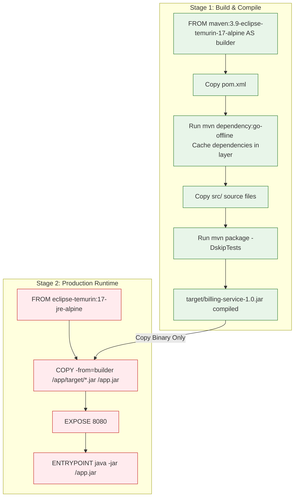

# Maven Build Automation Study Notes: Day 5 (1 May 2026)
## Topic: Maven and Docker Integration, Multi-Stage Builds, and Image Registries

On Day 5, we close our syllabus with the modern DevOps standard: Containerization. We learn how to build lightweight Docker images for Java applications using Multi-Stage Dockerfiles, integrate Docker compilations directly into the Maven build lifecycle, and push final images to OCI registries.

---

## 1. Detailed Theory Notes

### Containerizing Maven-Based Applications
To run a Java application inside a Docker container, you must build an OCI-compliant container image containing the Java Runtime Environment (JRE) and your compiled project code.
* **The Legacy Approach**: Developers compiled the Uber-JAR locally using Maven, copied it into a Docker image, and ran it. This made the build dependent on the local host's environment, violating CI/CD isolation rules.
* **The Modern Approach**: Run the entire build process *inside* the container using **Multi-Stage Docker builds**.

### Multi-Stage Dockerfile Architecture
Multi-stage builds use multiple `FROM` statements inside a single `Dockerfile` to create temporary, isolated build environments and extract only the final compiled binary:

* **Stage 1 (Build Environment)**:
  * Uses a heavy image containing the full Maven and JDK installations (e.g. `maven:3.9-eclipse-temurin-17-alpine`).
  * Copies `pom.xml` and source directories, downloads all dependencies, and compiles the project into an Uber-JAR using `mvn package`.
* **Stage 2 (Runtime Environment)**:
  * Uses a minimal image containing only the lightweight Java Runtime Environment (e.g. `eclipse-temurin:17-jre-alpine` or a distroless image).
  * Copies **only** the compiled `.jar` file from Stage 1 into the new image.
  * Discards all source files, unit tests, and Maven download caches.
  * **Result**: A highly secure, production-ready container image with a minimal footprint (e.g., 150MB instead of 800MB).

### Maven Docker Plugins
Instead of running separate `docker build` commands, you can automate container creation using Maven plugins like the **`docker-maven-plugin`** (from fabric8) or the **`dockerfile-maven-plugin`** (from Spotify).
* **Automated Bindings**: These plugins bind container compilation directly to Maven lifecycle phases. For example:
  * `dockerfile:build` is bound to the **`package`** phase.
  * `dockerfile:push` is bound to the **`deploy`** phase.
  Running `mvn clean deploy` compiles the code, packages the Uber-JAR, builds the Docker image, and pushes it to a remote registry automatically.

---

## 2. Multi-Stage Docker Build Flow (Mermaid)

The workflow diagram below represents how a multi-stage Dockerfile builds and packages a Java application, discarding heavy compiler tools to produce a lightweight production container:



---

## 3. Production-Grade Configuration Examples

### Multi-Stage `Dockerfile`
Save this file in the root of your project directory as `Dockerfile`:
```dockerfile
# ==========================================
# STAGE 1: Build and Package Application
# ==========================================
FROM maven:3.9.6-eclipse-temurin-17-alpine AS builder

WORKDIR /app

# Copy only the POM file first to leverage Docker layer caching
COPY pom.xml .

# Download dependencies offline to cache them in a dedicated layer
RUN mvn dependency:go-offline -B

# Copy the actual project source directories
COPY src ./src

# Compile the codebase and package the executable Uber-JAR
RUN mvn package -DskipTests

# ==========================================
# STAGE 2: Lightweight Production Runtime
# ==========================================
FROM eclipse-temurin:17-jre-alpine

WORKDIR /app

# Copy only the compiled Uber-JAR from Stage 1
COPY --from=builder /app/target/*.jar app.jar

EXPOSE 8080

# Configure secure non-root user execution (Best Practice)
USER 10001:10001

ENTRYPOINT ["java", "-jar", "app.jar"]
```

### Maven POM Plugin Integration (`pom.xml`)
```xml
<plugin>
    <!-- fabric8 Docker Maven Plugin -->
    <groupId>io.fabric8</groupId>
    <artifactId>docker-maven-plugin</artifactId>
    <version>0.43.4</version>
    <configuration>
        <!-- Registry host URL -->
        <registry>ghcr.io</registry>
        <images>
            <image>
                <name>ghcr.io/${project.groupId}/${project.artifactId}:${project.version}</name>
                <build>
                    <!-- Uses the project's root Dockerfile -->
                    <dockerFileDir>${project.basedir}</dockerFileDir>
                </build>
            </image>
        </images>
    </configuration>
    <executions>
        <!-- Bind container compilation automatically to standard phases -->
        <execution>
            <id>build-image</id>
            <phase>package</phase>
            <goals>
                <goal>build</goal>
            </goals>
        </execution>
        <execution>
            <id>push-image</id>
            <phase>deploy</phase>
            <goals>
                <goal>push</goal>
            </goals>
        </execution>
    </executions>
</plugin>
```

---

## 4. Practical Exercises

### Exercise 1: Build a Multi-Stage Image
1. Add the multi-stage `Dockerfile` defined in Section 3 to your Java project repository.
2. Build the image using the standard Docker command line:
   ```bash
   docker build -t billing-service:latest .
   ```
3. Run the container locally:
   ```bash
   docker run -d -p 8080:8080 --name my-billing-app billing-service:latest
   ```
4. Verify the application runs successfully by accessing it via curl: `curl http://localhost:8080`.
5. Run `docker images` and compare the size of your multi-stage JRE image against a standard image that includes the full Maven compiler.

### Exercise 2: Maven Docker Plugin Automation
1. Configure the `docker-maven-plugin` in your project's `pom.xml` as shown in Section 3.
2. Run the packaging phase:
   ```bash
   mvn clean package
   ```
3. Verify in the execution logs that Maven automatically parses the `Dockerfile` and builds the container image upon successful compilation of the Uber-JAR.

---

## 5. Viva Questions (University Exam prep)

**Q1: What are the two distinct phases in a Multi-stage Dockerfile for a Java application?**
* **Answer**:
  1. **Build Stage**: Uses a heavy parent image containing the full Maven and JDK installations to compile source code and package the Uber-JAR.
  2. **Runtime Stage**: Uses a lightweight JRE base image, copying *only* the compiled Uber-JAR from the build stage and discarding all compilers, source files, and caches.

**Q2: What is the main security benefit of using a Multi-stage Dockerfile?**
* **Answer**: It excludes compilation tools (compilers, build engines) and application source files from the final production container. This minimizes the image's surface area, reducing the risk of security vulnerabilities and preventing attackers from accessing source files or compilers if the container is compromised.

**Q3: How do you bind Docker image builds to the Maven lifecycle package phase?**
* **Answer**: By adding a Docker plugin (like `docker-maven-plugin` or `dockerfile-maven-plugin`) to the `<build>` block in your `pom.xml` and configuring the `build` goal inside the `<executions>` block to bind to the `package` phase.

**Q4: How do you optimize dependency downloading in Docker builds to save time?**
* **Answer**: By copying `pom.xml` first and executing **`mvn dependency:go-offline`** before copying the source code. This downloads all dependencies and caches them in a dedicated Docker layer, preventing Docker from re-downloading dependencies on subsequent builds unless the `pom.xml` file changes.

---

## 6. Interview Questions (Placement prep)

**Q1: Discuss the advantages and trade-offs of using Maven Docker plugins (like Spotify's dockerfile-maven or Fabric8's docker-maven) versus standard shell scripts in a CI/CD pipeline.**
* **Answer**:
  * **Maven Docker Plugins**:
    * *Pros*: Integrates container compilation directly into standard Maven commands (`mvn deploy`). Version coordinates are unified; the image automatically inherits coordinates (GAV) declared in `pom.xml`.
    * *Cons*: Couples project compilation to the Docker daemon. Requires the local build environment to have Docker installed, which can make builds complex on clean agent VMs without Docker.
  * **Shell Scripts (`docker build ...`)**:
    * *Pros*: Decouples application build from container packaging. Simplifies pipelines; you compile the binary with Maven first and package it with Docker in a separate step.
    * *Cons*: Requires manually parsing POM version metadata to tag images correctly, which can lead to version tagging mismatches.

**Q2: How do you securely authenticate a Maven Docker plugin with an external registry (like Docker Hub or GHCR) without hardcoding credentials in the `pom.xml`?**
* **Answer**:
  1. **Environment Variables**: Configure the plugin to fetch credentials from the system environment during build time.
  2. **Maven `settings.xml`**: Store credentials securely in your local `~/.m2/settings.xml` inside a `<server>` block, matching the `<id>` of the registry declared in `pom.xml`:
     ```xml
     <server>
         <id>ghcr.io</id>
         <username>danishanwar</username>
         <password>DECRYPTED_TOKEN</password>
     </server>
     ```
  The plugin automatically fetches the matching credentials from the local host system dynamically.

**Q3: Explain how you would deploy a containerized Maven application to a production environment. What parameters should be configured in the container startup script?**
* **Answer**:
  1. **User Privileges**: Run the container under a non-root user (e.g. `USER 10001`) to prevent system compromises.
  2. **Memory Constraints**: Configure JVM memory flags explicitly to prevent the application from exceeding container memory limits (which triggers an immediate Out-Of-Memory OOM kill):
     `java -XX:MaxRAMPercentage=75.0 -jar app.jar`
  3. **Port Mappings**: Map ports correctly (e.g., `-p 80:8080`) to route external traffic to the container runtime.

---

## 7. Best Practices

* **Always Cache Dependencies**: Leverage Docker layer caching by copying and resolving the `pom.xml` before copying the source code directory.
* **Run as Non-Root**: Never run your Java process as the root user inside production containers.
* **Limit JVM Heap Size**: Always configure container memory constraints using JRE flags like `-XX:MaxRAMPercentage` to prevent JVM memory allocation crashes.

---

## 8. Common Mistakes

* **Copying Maven Cache**: Accidentally copying the local `.m2/repository` directory from the host machine into the Docker build context, which increases image compilation times and results in bloated images.
* **Hardcoded POM Versions in Docker tags**: Hardcoding static version tags in the Dockerfile instead of letting Maven pass version metadata dynamically during build time.
* **Missing JRE Alpine Runtime environment**: Using base images that lack standard libraries required by the Java runtime, resulting in immediate container crashes during startup.

---

## 9. Summary Notes for Last-Minute Revision

* **Multi-Stage Build**: Separate build environment (heavy Maven image) from runtime environment (light JRE image).
* **dependency:go-offline**: Pre-downloads dependencies inside the builder layer to leverage Docker's build cache.
* **settings.xml**: Securely stores registry credentials for Maven plugins on the host machine.
* **USER block**: Run the container using a non-root user for security.
